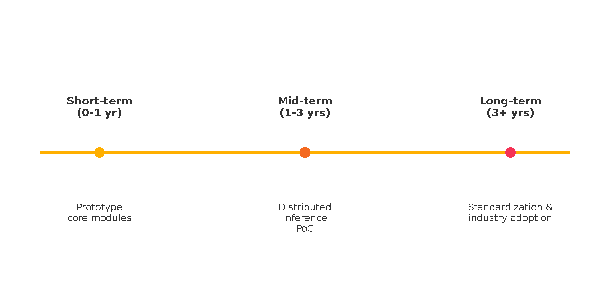

**超高効率AI言語による知識表現と推論：理論と実装**

**著者:** Ordnari-Persun

**ステータス:** 校了版

**Table of Contents v1.4**

**第1章 序論**

**1.1 背景と目的**

近年の人工知能（AI）研究において、自然言語処理は大きな進歩を遂げ、大規模言語モデル（LLM）に代表される技術は、驚異的なテキスト生成能力を示す一方で、**内部表象の不可視性**および**長距離論理推論の劣化**といった課題を抱えている。また、従来の記号処理AIは、推論の透明性や厳密性を有するものの、実世界における多様で曖昧な情報を効率的に処理し、頑健な知覚・行為と統合することに課題があった。時間的・空間的状況における高精度な意味理解と判断は、認知アーキテクチャ、ロボティクス、エージェント制御系、自然言語処理といった多くの応用分野で依然として中核的課題となっている。

本理論の目的は、これらの限界を克服し、人間のような柔軟な知識表現、論理的かつ効率的な推論、動的な世界モデルの維持、および実世界との密接なインタラクションを可能にする、新しいAI言語システムの形式的な基礎を提供することにある。本研究で提案する超高効率AI言語は、形式意味論、論理学、認知科学、およびロボティクスにおける知見を統合し、言語理解から知的な振る舞いまでの一貫した理論体系を構築することを目指す。具体的には、複雑な事象や状態、関係性を厳密に表現する形式言語を定義し、その上で、時間、空間、不確実性といった側面を包含する高度な推論メカニズム、そして外部環境との相互作用を可能にする知覚・行為システムとの連携機構を形式的に記述する。最終的な目的は、この理論が、効率的で解釈可能性が高く、**標準互換性・法規制適合性**を考慮した、現実世界に適応可能な次世代AIシステムの設計指針となることである。（標準互換性・法規制適合については第10章で詳述する。）

**1.2 本理論の位置づけと意義**

本理論は、AIのための意味表現と言語構築における諸分野――知識表現、意味論、記号論理、計算言語学、ロボティクス、計算認知モデルなど――の交差点に位置するものであり、それらの知見を融合しつつ、従来のアプローチでは未解決であった根本的問題群に取り組むものである。

具体的には、本理論は以下のような観点から独自の意義を有する：

(1) 「統一的意味表現基盤」としての役割 従来のAIにおける知識記述体系は、目的に応じて異なる形式（記号論理、記述論理、オントロジー、制約ネットワークなど）を採用してきたが、それらはしばしば断片的かつ用途依存的であり、システム間の意味的整合性や推論互換性に課題があった。 本理論が定義する言語体系は、極小構造（ミニマル・メタシンボル）とその形式構成規則にもとづき、すべての意味構成・関係性・時間／空間的制約を記述可能とする完全な統一モデルを志向している。これにより、意味記述・知識構成・推論処理が単一フレームワーク内で完結し、AIシステム全体の透明性と拡張性が飛躍的に向上する。

(2) 「時間的・空間的推論能力」の精密な統合 AIにとって、時間的順序や空間配置の理解は、行為選択、因果推論、状況把握、対話理解などの中核を成す。しかし、従来の形式体系ではこれらを意味的に柔軟に記述し、かつ形式的推論対象とすることは困難であった。 本理論は、時間的アスペクト、出来事構造、空間関係、行為予測などを厳密に扱うための形式的推論規則集合と、それらを駆動する意味論的エンジンを備えており、人間レベルの状況理解と判断をAIに与えるための理論的基盤を提供する。

(3) 「形式的意味構成」のための新たな構文意味論的パラダイム 本理論が提唱する「構成規則にもとづく意味構成」は、自然言語における曖昧性や文脈依存性を解消しつつ、構文・意味・知識の三者を統一的に記述するための新たなパラダイムとなることを意図している。これは、自然言語処理や認知モデルの文法理論においても、新たな分析枠組みとして寄与しうる。

**1.3 用語定義**

本書においては、超高効率AI言語の理論的構築に関連する専門用語が多数登場するため、以下に主要な用語を定義する。以降の章における記述では、これらの用語を一貫した意味で使用する。詳細な定義や他の関連用語については、必要に応じて各章の文脈で補足するか、付録Eの用語集を参照のこと。

* **基本シンボル (Basic Symbol / Semantic Atom):** 本理論の中核をなす最小構成要素であり、意味的カテゴリに対応する抽象的な記号単位。例：エンティティタイプ（例: `PhysicalObject`）、特定のエンティティインスタンスID（例: `e_ball_001`）、属性タイプ（例: `Color`）、関係タイプ（例: `PartOf`）、行為タイプ（例: `Move`）など。これらはType-Aメタシンボルとも呼ばれる。  
* **メタシンボル (Meta-symbol):** 意味の構成、変換、推論指示といった高次操作を可能にするシンボル。Type-A（基本シンボル）と区別される場合、Type-Bメタシンボルを指す。Type-Bは意味構成の**構造や操作**を指示する構成記号（例：`Seq`(系列化), `Rev`(反転), `Pred`(述語化), `Arg`(引数化), `Time`(時間指定), `Space`(空間指定), `Neg`(否定), `Poss`(可能性), `Belief`(信念)など）。  
* **意味構造式（Semantic Structure Expression, SSE）:** 基本シンボル、メタシンボル、および構成規則によって組み立てられる、完全形式化された意味表現式。AIが内部的に保持・処理する知識、状況、意図、質問、推論単位などを統一的に記述するための形式的文である（付録Aを参照）。  
* **構成規則（Composition Rule）：** 複数の基本シンボルや意味構造式を組み合わせてより高次の意味構造式を生成するための明示的な構文・意味合成ルール。これらの規則は、各合成が生む意味的含意も同時に指定する。  
* **意味合成エンジン（Semantic Composition Engine）：** 構成規則群を駆動させ、入力されたシンボル列や意味構造式から、より複雑な意味構造式を構築・解釈・評価するAI内部の機構。自然言語処理における意味解析や、推論実行前の意味正規化などに用いられる。  
* **推論規則（Inference Rule）：** 意味構造式間の論理的な含意、整合性、矛盾などを評価し、新たな意味構造式（結論）を導出するための形式的な意味推論機構。汎用的な規則から、時間・空間・信頼性といった特定の知識ドメインに特化した規則までを含む（付録Dを参照）。  
* **命題（Proposition）：** 世界の状態やエージェントの信念に関する形式的な主張であり、評価可能な真偽の値（または信頼度）を持つ意味構造式。基本的な情報の単位となる。  
* **世界モデル（WorldModel）：** エージェントが認識する、客観的な事実や世界の真であると信じている状態に関する命題の集合を保持する構造体。WorldModel内の情報は命題として表現される。  
* **コンテキストモデル（ContextModel）：** エージェントの内部状態（信念、願望、意図、感情など）や、対話状況、タスク状態といった主観的または状況依存的な情報の集合を保持する構造体。WorldModelと同様に命題の集合として表現されるが、エージェント固有の信念（例: 他エージェントの信念に関する信念）や公共信念（複数のエージェント間で共有される信念）もここに保持されうる（詳細は第9章を参照）。  
* **外部環境インターフェース（External Environment Interface, EEI）：** AIの内部形式（意味構造式）と外界の知覚データ・行為指令との間で、形式的な変換と意味的な整合性を仲介するための理論的枠組み。  
* **対話管理モジュール（Dialogue Management Module）：** 人間との多ターン対話において、対話状態の追跡、発話意図の解釈、応答内容の決定、発話の生成を統括するモジュール。知識ベース、推論エンジン、計画モジュールなどと連携する。

**1.4 本書の構成**

本書は、超高効率AI言語の理論的枠組みとその応用可能性を、形式的・構造的に明示し、段階的に理解できるよう構成されている。以下に、本書の各章における主な内容と役割を概説する。

**第1章：序論** 　本章では、本理論の背景、目的、位置づけ、および本書の全体構成を提示する。AIにおける意味表現と推論の高度化に資する、新たな言語枠組みの意義を明示する。

**第2章：基本概念とコアデータ構造** 　本章では、本言語理論における中心的概念――メタシンボル、意味構造式（SSE）、型システム、エンティティ記述モデルなど――の定義と、その基盤となる抽象構造について記述する。データ構造と意味的役割の整合性を保証する設計原理を明確化する。

**第3章：関係性と属性の表現** 　この章では、意味構造内におけるエンティティ間の構造的・意味的関係や属性のモデル化に焦点を当て、関係表現子、属性記述構文、階層的意味分解など、複雑な意味構造を構築するための記法と設計原理を詳細に説明します。

**第4章：時間推論の理論と応用** 　本章では、時間的情報（時制、継続、順序、因果関係）の扱い方を形式化する。アスペクト合成、Temporal Predicate、Temporal Inference Rule (TIR) の定義と動作原理を含み、高度な時間推論を可能にする理論基盤を記述する。

**第5章：空間推論の理論と応用** 　時間軸と並ぶもう一つの重要軸として、空間的構造とその意味的解釈（例：位置関係、方向性、近接性）の表現と推論法を定義する。Qualitative Spatial Reasoning（QSR）に基づき、空間知識の獲得・記述・推論手法を形式的に提示する。

**第6章：汎用推論エンジンの核** 　本章では、時間や空間といった特定のドメインに依存しない、知識ベースに対する汎用的な推論エンジンの設計思想、コアアルゴリズム、および規則適用プロセスを詳述する。形式的な定義関数、セマンティックネットワークとの連携、そして信頼度伝播の抽象的なメカニズムを含みます。

**第7章：システム全体の実行フロー統合** 　本章では、自然言語理解（NLU）から自然言語生成（NLG）、そして推論過程を含む、超高効率AI言語システム全体の情報処理パイプラインがどのように構成され、各モジュールが連携して機能するかを詳細に記述します。実行フローにおける状態遷移、データフロー、および制御構造を含みます。

**第8章：知識ドメイン別推論機構（時間・空間・信頼性など）** 　本章では、汎用推論エンジン（第6章）を基盤として、特定の知識領域における推論をいかに実現するかを記述します。時間推論（TIR）、空間推論（QSR）、および信頼度推論といった、各ドメインに特化した推論規則セットと、それらを汎用エンジン上で応用・統合する具体的な機構を詳述します。

**第9章：対話管理モジュール** 　本章では、人間との多ターン対話において、対話状態の追跡、発話意図の解釈、応答内容の決定、発話の生成を統括するモジュール。知識ベース、推論エンジン、計画モジュールなどと連携する。

**第10章：実装上の考慮事項と最適化** 　本章では、本理論体系に基づいた実際の実装における技術的な課題と解決策を論じます。パフォーマンス最適化戦略、モジュールのスケーラビリティ、拡張性と保守性の設計、およびテスト・検証のフレームワークといった実践的な側面を扱います。

**第11章：結論と今後の展望** 　最終章では、本書で述べられた理論全体を総括し、超高効率AI言語の意義、達成された成果、未解決課題、および将来的な研究開発・応用・コミュニティ展開の展望について述べます。

---

**第2章 基本概念とコアデータ構造**

本章では、超高効率AI言語の理論体系を構築するための最も基本的な要素と、それらを構造化する主要なデータ構造について形式的に定義する。ここで定義される概念は、本書全体を通じて意味表現、知識蓄積、および推論の基盤となる。

**2.1 基本エンティティの定義**

本理論において、\*\*エンティティ（Entity）\*\*は意味構造における基本的な対象または概念を表す。エンティティは、具体的な物理的オブジェクト（例: "ボール"）、抽象的な概念（例: "公平さ"）、特定の場所（例: "部屋A"）、または特定の時間点／区間（例: "昨日"）など、あらゆる識別可能なものを指しうる。各エンティティは一意の識別子（EntityID）を持ち、エンティティ全体の集合を $\\mathcal{E}$ と表記する。EntityIDのような命名規則は、CamelCaseまたはsnake\_caseを主に使用する（付録E参照）。

$$\\mathcal{E} := { \\mathrm{e}\_1, \\mathrm{e}\_2, \\mathrm{e}\_3, \\ldots }$$

エンティティは、その性質や役割に応じて異なるカテゴリに分類される場合がある（例: PhysicalObject, AbstractConcept, Location, Timepoint, Eventなど）。これらのカテゴリは、後述する型システムによって管理される（付録Bを参照）。

**2.2 コアデータ構造の詳細**

知識や情報を表現するために、本理論ではいくつかの中心的なデータ構造を定義する。

* **値（Value）：** エンティティの属性などを記述する際に使用される、数、文字列、真偽値、または特定の定義済みスケール上の点などを表す形式的な要素。値全体の集合を $\\mathcal{V}$ と表記する。 $$\\mathcal{V} := \\mathbb{R} \\cup \\mathbb{Z} \\cup \\mathbb{B} \\cup \\mathrm{String} \\cup \\mathrm{Enum}(\\mathrm{Category}) \\cup \\ldots$$  
* **命題（Proposition）：** 世界の状態やエージェントの信念に関する、評価可能な真偽の値を持つ形式的な主張。命題は、エンティティ間の関係、エンティティの属性、イベントの発生などを記述し、その構造は述語とその引数リストとして表現される。 $$ $$$$\\mathrm{Proposition} := \\langle P, \\overrightarrow{a}, \\tau, \\sigma, \\kappa \\rangle $$ $$$$ここで、$P$は述語（Predicate）シンボル、$\\overrightarrow{a}$はエンティティや値のリスト（引数 Arguments）、$\\tau$は時間表現（Time）、$\\sigma$は空間表現（Space）、$\\kappa$は信頼度値（Confidence）を表す。信頼度 $\\kappa$ の型は、単純なスカラー値 \[0,1\] から区間確率や確率分布へと拡張可能であり、その具体的なモデルと演算（信頼度演算代数）は第8章で詳述される。  
* **世界モデル（WorldModel）：** エージェントが認識する、客観的な事実や世界の真であると信じている状態に関する命題の集合を保持する構造体。WorldModel内の情報は命題として表現される。 $$ $$$$\\mathrm{WorldModel} := { \\mathrm{p}\_i \\mid \\mathrm{p}\_i \\in \\mathrm{Proposition} } $$ $$$$WorldModelは動的であり、知覚入力や推論結果、信念改訂によって更新される。矛盾する命題が検出された場合、信頼度や更新ポリシー（例: より新しい情報、より信頼できる情報源を優先）に基づいた解消メカニズムが適用される（詳細は第7章および第8章を参照）。  
* **コンテキストモデル（ContextModel）：** エージェントの内部状態（信念、願望、意図、感情など）や、対話状況、タスク状態といった主観的または状況依存的な情報の集合を保持する構造体。WorldModelと同様に命題の集合として表現されるが、エージェント固有の信念（例: 他エージェントの信念に関する信念）や公共信念（複数のエージェント間で共有される信念）もここに保持されうる（詳細は第9章を参照）。 $$ $$$$\\mathrm{ContextModel} := { \\mathrm{p}\_j \\mid \\mathrm{p}\_j \\in \\mathrm{Proposition} } $$ $$$$ $$**2.3 シンボルとメタシンボルの体系**

本理論の中核的な表現要素は\*\*シンボル（Symbol）\*\*であり、これは意味論的なカテゴリに対応する抽象的な記号単位である。シンボル全体の集合を $\\mathcal{S}$ と表記する。シンボルは、単独で意味を持つ基本シンボルと、他のシンボルや構造に対して作用するメタシンボルに分類される。

* **基本シンボル（Basic Symbol / Semantic Atom）：** 第1.3節で定義したType-Aメタシンボルと同義。エンティティカテゴリ、特定のエンティティインスタンスID、属性カテゴリ、関係カテゴリ、行為カテゴリなど、具体的な意味概念のタイプを表す（付録B参照）。 $$ $$$$\\mathrm{BasicSymbol} \\subset \\mathcal{S} $$ $$$$ $$  
* **メタシンボル（Meta-symbol）：** 意味の構成、変換、推論指示といった高次操作を可能にするシンボル。基本シンボル（Type-A）と区別される場合、**Type-Bメタシンボル**を指す。Type-Bは意味構成の**構造や操作**を指示する構成記号である（付録B参照）。 $$ $$$$\\mathrm{MetaSymbol}\_{\\mathrm{Type-B}} \\subset \\mathcal{S} $$ $$$$例：`Seq`(系列化), `Rev`(反転), `Pred`(述語化), `Arg`(引数化), `Time`(時間指定), `Space`(空間指定), `Neg`(否定), `Poss`(可能性), `Belief`(信念), $\\ldots$

シンボルは、意味構造式（SSE）を構築するための原子的な構成要素であり、後述する型システムと構成規則によって組み合わせられる。

**2.4 型システム**

本言語体系は、厳密な\*\*型システム（Type System）**を持つ。各シンボル、エンティティ、値、および意味構造式は**型（Type）\*\*を持ち、構成規則や推論規則の適用は型の整合性によって制約される。型システムは、意味的な誤りや無効な推論を早期に検出するために不可欠である。型全体の集合を $\\mathcal{T}$ と表記する。

$$\\mathcal{T} := { \\mathrm{T}*{\\mathrm{Entity}}, \\mathrm{T}*{\\mathrm{Attribute}}, \\mathrm{T}*{\\mathrm{Relation}}, \\mathrm{T}*{\\mathrm{Proposition}}, \\mathrm{T}*{\\mathrm{Time}}, \\mathrm{T}*{\\mathrm{Space}}, \\ldots }$$ $$\\mathrm{HasType} : \\mathcal{S} \\cup \\mathcal{E} \\cup \\mathcal{V} \\cup \\mathrm{SSE} \\to \\mathcal{T}$$

型の階層（例: $\\mathrm{T}*{\\mathrm{PhysicalObject}} \\subseteq \\mathrm{T}*{\\mathrm{Entity}}$）も定義される。特定の Predicate シンボルは、引数の型と数に対する制約を示す\*\*シグネチャ（Signature）\*\*を持つ。

$$\\mathrm{Signature}(P) \\equiv P : \\mathrm{T}*{\\mathrm{arg1}} \\times \\mathrm{T}*{\\mathrm{arg2}} \\times \\cdots \\times \\mathrm{T}\_{\\mathrm{argn}} \\rightarrow \\mathbb{B} \\quad (\\text{or } \[0,1\])$$ ここで、$\\mathrm{T}\_{\\mathrm{argi}}$は引数 $\\mathrm{arg}\_i$ の型、$\\mathbb{B}$は真理値集合 ${ \\mathrm{True}, \\mathrm{False} }$、あるいはより一般的には信頼度値の集合である（付録B参照）。

意味合成エンジンや推論エンジンは、この型制約を満たさない関係性表現を構文的に無効として扱うか、意味的に無効な命題としてフラグ付けする。

**2.5 正準化**

\*\*正準化（Canonicalization）\*\*は、意味的に等価な複数の意味構造式表現を、唯一の標準形（Canonical Form）に変換するプロセスである。これにより、知識の重複を防ぎ、推論の効率を高める。正準化規則は、構文的なバリエーションや意味的に自明な変換（例: 二重否定の除去、特定のメタ記号合成の正規順序化）を標準形に統一する。正準化は、型システムが適用された後の、有効な意味構造式に対して行われる。

$$\\mathrm{CanonicalForm} : { \\mathrm{sse} \\in \\mathrm{SSE} \\mid \\mathrm{IsValidType}(\\mathrm{sse}) } \\to \\mathrm{SSE}\_{\\mathrm{Canonical}}$$ $$\\mathrm{sse}\_1 \\equiv \\mathrm{sse}\_2 \\iff \\mathrm{CanonicalForm}(\\mathrm{sse}\_1) \= \\mathrm{CanonicalForm}(\\mathrm{sse}\_2)$$

**例示：**

* 二重否定の除去: $\\langle \\mathrm{Neg}, \\langle \\mathrm{Neg}, p \\rangle \\rangle ;\\to; p$  
* 引数順序の正規化（述語定義で引数にラベル付けされている場合など）：$\\langle \\mathrm{Move}, (\\mathrm{agent}: \\mathrm{e}*{\\mathrm{robot}}, \\mathrm{destination}: \\mathrm{loc}*{\\mathrm{room}}) \\rangle \\equiv \\langle \\mathrm{Move}, (\\mathrm{destination}: \\mathrm{loc}*{\\mathrm{room}}, \\mathrm{agent}: \\mathrm{e}*{\\mathrm{robot}}) \\rangle$ → $\\langle \\mathrm{Move}, (\\mathrm{agent}: \\mathrm{e}*{\\mathrm{robot}}, \\mathrm{destination}: \\mathrm{loc}*{\\mathrm{room}}) \\rangle$ （正規順序）  
* 特定の合成のべき等性（注意：全ての合成がべき等ではない）：例：特定のラベル付けメタ記号 $\\langle \\mathrm{Label}(\\text{"Important"}), \\langle \\mathrm{Label}(\\text{"Urgent"}), \\mathrm{p} \\rangle \\rangle ;\\to; \\langle \\mathrm{Label}(\\text{"Urgent"}), \\mathrm{p} \\rangle$ （「Urgent」ラベルが付いたら、「Important」ラベルは不要になるルールなど、特定の文脈依存的な正準化規則）

---

**第3章 関係性と属性の表現**

本章では、第2章で定義した基本要素とデータ構造を用いて、知識表現における中心的な概念であるエンティティ間の\*\*関係性（Relation）**およびエンティティの**属性（Attribute）\*\*をどのように形式的に記述するかを詳述する。これらの表現は、WorldModelやContextModelにおける命題構築の基盤となる。

**3.1 関係性モデル**

関係性は、一つ以上のエンティティ、値、または他の意味構造式を結びつけ、それらの間の特定の関連を示す形式的な概念である。本理論では、関係性を\*\*述語（Predicate）**とその**引数（Arguments）\*\*の組み合わせとしてモデル化する。述語は意味的カテゴリを持つシンボル（Basic Symbolまたは複合シンボル）であり、特定の数の引数をとる。

$$\\mathrm{Relation} := \\langle P, \\overrightarrow{a} \\rangle$$$$P \\in \\mathcal{S} \\quad (\\text{with type } \\mathrm{T}\_{\\mathrm{Predicate}})$$$$\\overrightarrow{a} := (\\mathrm{arg}\_1, \\mathrm{arg}\_2, \\ldots, \\mathrm{arg}\_n) \\quad \\text{where } \\mathrm{arg}\_i \\in \\mathcal{E} \\cup \\mathcal{V} \\cup \\mathrm{SSE}$$

関係性表現は、文脈に応じて評価可能な真偽の値（または信頼度）を持ち、これが第2.2節で定義した\*\*命題（Proposition）\*\*の核となる。（命題 $\\langle P, \\overrightarrow{a}, \\tau, \\sigma, \\kappa \\rangle$ の $P, \\overrightarrow{a}$ 部分に相当）。

関係性の型（例: BinaryRelation, TernaryRelation, TemporalRelation, SpatialRelation, BeliefRelationなど）は、Predicateシンボルの型によって規定され、引数の型と数に対する制約を伴う（第2.4節の型システムを参照）。

**3.2 属性・特性の定義**

属性（Attribute）または特性（Property）は、特定のエンティティが持つ性質や特徴を示す形式的な概念である。本理論では、属性を**特定の二項関係**としてモデル化する。この関係は通常、対象エンティティとその属性値を結びつける。

$$\\mathrm{Attribute} := \\langle P\_{\\mathrm{Attribute}}, (\\mathrm{entity}, \\mathrm{value}) \\rangle$$$$P\_{\\mathrm{Attribute}} \\in \\mathcal{S} \\quad (\\text{with type } \\mathrm{T}\_{\\mathrm{AttributePredicate}})$$$$\\mathrm{entity} \\in \\mathcal{E}, \\mathrm{value} \\in \\mathcal{V}$$

例：$\\langle \\mathrm{HasColor}, (\\mathrm{e}\_{\\mathrm{ball\_001}}, \\text{"red"}) \\rangle$ （ボール\_001の色は赤である）。ここでは `HasColor` が属性述語として用いられている。 属性もまた、命題としてWorldModelやContextModelに含まれる。

**3.3 リレーションの型と制約**

リレーション（関係性）は厳密な型システムによって管理される（第2.4節を参照）。Predicateシンボルの型は、それがどのような引数の型と数をとるかを定義する\*\*シグネチャ（Signature）\*\*を持つ。これは、述語を引数の型空間から真理値空間への関数と見なす記述と一致する。

$$\\mathrm{Signature}(P) \\equiv P : \\mathrm{T}*{\\mathrm{arg1}} \\times \\mathrm{T}*{\\mathrm{arg2}} \\times \\cdots \\times \\mathrm{T}\_{\\mathrm{argn}} \\rightarrow \\mathbb{B} \\quad (\\text{or } \[0,1\])$$ ここで、$\\mathrm{T}\_{\\mathrm{argi}}$は引数 $\\mathrm{arg}\_i$ の型、$\\mathbb{B}$は真理値集合 ${ \\mathrm{True}, \\mathrm{False} }$、あるいはより一般的には信頼度値の集合である（付録B参照）。

意味合成エンジンや推論エンジンは、この型制約を満たさない関係性表現を構文的に無効として扱うか、意味的に無効な命題としてフラグ付けする。

\*\*制約（Constraints）\*\*は、特定の関係性が成立するために満たされるべき条件や、関係性間に存在する依存性や排他性を示す。これらは推論規則や知識表現構造の一部として、リレーション間の関係として定義される。

例：空間的制約 `SpatiallyExclusive(loc1, loc2)` （場所loc1とloc2は互いに排他的である）に基づき、`LocatedAt(e, loc1, t)` と `LocatedAt(e, loc2, t)` は同じエンティティが同時刻に両方の場所に存在する命題を構成できない。

**3.4 複合関係性の表現方法**

より複雑な知識構造、例えば関係性に関する関係性（Reification）、多項関係、あるいは意味構造式全体を引数とする関係性は、再帰的な構造を持つ意味構造式を用いて表現される。

* **Reification（再体化）：** 関係性それ自体をエンティティのように扱い、その関係性に関する属性や関係性を記述する。これは、ある意味構造式（通常は命題）を別の意味構造式の引数とすることで実現される。 例：$\\langle \\mathrm{Intensity}, (\\langle \\mathrm{Loves}, (\\mathrm{e}*{\\mathrm{taro}}, \\mathrm{e}*{\\mathrm{hanako}}) \\rangle, \\text{"strong"}) \\rangle$ （太郎が花子を愛しているという関係性の強さは「強い」）。ここで、$\\langle \\mathrm{Loves}, (\\mathrm{e}*{\\mathrm{taro}}, \\mathrm{e}*{\\mathrm{hanako}}) \\rangle$ という関係性表現全体が `Intensity` という述語の第一引数となっている。  
* **多項関係：** 二項関係では表現しきれない、三つ以上の引数を持つ関係性（例: `Give(agent, recipient, object, time, location)`）。述語のシグネチャで多項性を定義する（第3.1節を参照）。  
* **意味構造式を引数とする関係性:** 知覚、信念、コミュニケーション、意図といった概念は、対象となる意味構造式全体を引数として取る関係性としてモデル化される。 例: $\\langle \\mathrm{Believes}, (\\mathrm{e}*{\\mathrm{agent\_1}}, \\langle \\mathrm{LocatedAt}, (\\mathrm{e}*{\\mathrm{ball\_001}}, \\mathrm{loc}*{\\mathrm{table\_001}}, \\mathrm{t}*{\\mathrm{now}}) \\rangle) \\rangle$ （エージェント\_1は、ボール\_001がテーブル\_001にあると信じている）。 例: $\\langle \\mathrm{Says}, (\\mathrm{e}*{\\mathrm{agent\_2}}, \\mathrm{sse}*{\\text{"Please open the door"}}, \\mathrm{t}\_{\\mathrm{utterance}}) \\rangle$ （エージェント\_2は、時刻t\_utteranceに「ドアを開けてください」という意味構造式を表現した）。

このように、基本要素、型システム、および柔軟な引数構造を持つリレーションモデルを用いることで、単純な属性記述から複雑な関係性、そして関係性に関する関係性まで、多様な知識構造を統一的な形式で表現することが可能となる。

---

**第4章 時間推論の理論と応用**

本章では、超高効率AI言語における**時間**に関する情報の表現と、それに基づく推論の理論的基盤を構築する。AIが現実世界を理解し、計画を立て、行動するためには、出来事の順序、持続時間、同時性といった時間的関係性を正確に捉え、そこから新たな時間的知識を導出する能力が不可欠である。本章で定義される時間推論機構は、汎用推論エンジン（第6章）上で動作する、ドメイン特化推論機構の一つとなる（第8章参照）。

**4.1 時間概念の基礎**

本理論において、時間的な実体は主に\*\*時間点（Time Point）**と**時間区間（Time Interval）\*\*としてモデル化される。

* **時間点（Point, $\\mathbb{P}$）:** 瞬間的な出来事や状態変化が発生する、連続する時間軸上の位置。  
* **時間区間（Interval, $\\mathbb{I}$）:** 開始点と終了点を持つ時間軸上の期間。$\[t\_{start}, t\_{end}\]$ という形式で表される。

これらの時間的実体は、エンティティ（第2.1節）の一種として扱われうる。時間点全体の集合を $\\mathcal{P}$、時間区間全体の集合を $\\mathcal{I}$ と表記する。時間点および時間区間は、本言語の型システム（第2.4節）においてそれぞれ $\\mathrm{T}*{\\mathrm{TimePoint}}$ および $\\mathrm{T}*{\\mathrm{TimeInterval}}$ という型を持ち、これらは時間型 $\\mathrm{T}*{\\mathrm{Time}}$ のサブタイプである ($\\mathrm{T}*{\\mathrm{TimePoint}} \\subset \\mathrm{T}*{\\mathrm{Time}}, \\mathrm{T}*{\\mathrm{TimeInterval}} \\subset \\mathrm{T}*{\\mathrm{Time}}$)。将来的な拡張として、分岐時間軸（マルチタイムライン）を扱うための型 $\\mathrm{T}*{\\mathrm{TimeBranch}}$ などを導入する可能性も考慮される（付録B参照）。

出来事（Event）は特定の時間点または時間区間に結びつけられる（第2.2節の命題構造 $\\tau$ を参照）。時間推論の目的は、限られた時間的情報から、未知の時間的関係性（例: 「会議は昼食後」「昼食は12時から13時」$\\Rightarrow$ 「会議は13時以降」）を導出することにある。

時間表現は粒度（秒、日、年など）を持ちうる。異なる粒度の時間情報を扱う際には、ISO-8601等に準拠した正規化・正準化関数を用いて粒度を整合させる必要がある（詳細は第10章実装節で扱う）。ISO-8601の参照情報は付録Bに記載する。

**4.2 時間関係原子の集合**

時間点または時間区間間の基本的な二項関係を\*\*時間関係原子（Temporal Relation Primitive）\*\*と定義する。これらの関係は述語シンボルとして定義される（第3章参照）。

区間間の関係性記述には、James F. Allenによって提案された13個の基本関係が広く用いられる。これらの関係は排他的かつ網羅的であり、任意の二つの区間 $i\_1, i\_2$ の間には必ずこれらのうちの一つのみが成立する。これら13個のAllenの関係原子集合 $\\mathcal{R}\_{\\mathbb{I}}$ を以下に示す（逆関係も含む）。

| 関係 ($i\_1, i\_2$) | 逆関係 ($i\_2, i\_1$) | 記号 | 定義 ($i\_1 \= \[s\_1, e\_1\], i\_2 \= \[s\_2, e\_2\]$) |
| :---- | :---- | :---- | :---- |
| Before | After | `b` | $e\_1 \< s\_2$ |
| Meets | MetBy | `m` | $e\_1 \= s\_2$ |
| Overlaps | OverlappedBy | `o` | $s\_1 \< s\_2 \< e\_1 \< e\_2$ |
| Starts | StartedBy | `s` | $s\_1 \= s\_2 \< e\_1 \< e\_2$ |
| During | Contains | `d` | $s\_2 \< s\_1 \< e\_1 \< e\_2$ |
| Finishes | FinishedBy | `f` | $s\_2 \< s\_1 \< e\_1 \= e\_2$ |
| Equals | Equals | `eq` | $s\_1 \= s\_2$ かつ $e\_1 \= e\_2$ |

**表 4-1: Allen の 13 区間関係原子**

時間点間の関係性としては、$\\langle \\mathrm{Before}, (p\_1, p\_2) \\rangle$ ($p\_1 \< p\_2$)、$\\langle \\mathrm{After}, (p\_1, p\_2) \\rangle$ ($p\_1 \> p\_2$)、$\\langle \\mathrm{Equals}, (p\_1, p\_2) \\rangle$ ($p\_1 \= p\_2$) などが基本となる（第3章参照）。点と区間の間の関係性も定義可能である。これらの時間関係原子は、第3章で定義された関係性として意味構造式として表現される。例: $\\langle \\mathrm{Before}, (\\mathrm{interval}*{\\mathrm{lunch}}, \\mathrm{interval}*{\\mathrm{meeting}}) \\rangle$ 。

**4.3 代表的時間推論規則（TIR）**

時間推論規則（Temporal Inference Rule, TIR）は、既知の時間関係原子から新たな時間関係原子を導出するための形式的な規則である。これらの規則は、時間関係原子間の\*\*合成（Composition）\*\*に基づいている。二つの関係 $r\_1(i\_1, i\_2)$ と $r\_2(i\_2, i\_3)$ が既知である場合に、区間 $i\_1$ と $i\_3$ の間にどのような関係が成立しうるかを推論する。

Allenの関係における合成は、Allenの合成表（Composition Table）として形式化されている（付録 C.1 参照）。例えば、区間 $i\_1$ が $i\_2$ の `Before` であり、区間 $i\_2$ が $i\_3$ の `Meets` である場合、合成表によれば区間 $i\_1$ と $i\_3$ の間には `Before` の関係が成立する。

$$\\langle \\mathrm{Before}, (i\_1, i\_2) \\rangle \\wedge \\langle \\mathrm{Meets}, (i\_2, i\_3) \\rangle \\Rightarrow \\langle \\mathrm{Before}, (i\_1, i\_3) \\rangle \\quad \\text{(TIR-001)}$$

より複雑な例として、 $i\_1$ が $i\_2$ の `Overlaps` であり、 $i\_2$ が $i\_3$ の `Overlaps` である場合、合成表によれば $i\_1$ と $i\_3$ の間には `Before`, `Meets`, `Overlaps`, `Starts`, `During`, `Finishes`, `Equals`, `MetBy`, `OverlappedBy` の\*\*いずれか（論理和）\*\*の関係が成立しうる。これは、時間推論における不確定性や複数の可能性を示す。可能な関係性の集合の順序は、Allen標準の順序に沿って記述される。

$$\\langle \\mathrm{Overlaps}, (i\_1, i\_2) \\rangle \\wedge \\langle \\mathrm{Overlaps}, (i\_2, i\_3) \\rangle \\Rightarrow \\langle \\mathit{rel}, (i\_1, i\_3) \\rangle \\text{ where } \\mathit{rel} \\in { \\mathrm{Before}, \\mathrm{Meets}, \\mathrm{Overlaps}, \\mathrm{Starts}, \\mathrm{During}, \\mathrm{Finishes}, \\mathrm{Equals}, \\mathrm{MetBy}, \\mathrm{OverlappedBy} } \\quad \\text{(TIR-002)}$$

本理論体系では、Allenの関係だけでなく、時間点間の関係や点と区間の関係、さらに第5章で扱う時間的アスペクト（進行相、完了相など）に関する推論規則も定義する。これらのTIRは、第6章で定義された推論規則（Inference Rule）の形式（前提と結論を持つ）に従い記述される。完全なTIRリストは付録に記載する。

**4.4 時間制約評価と推論エンジンへの組込み**

知識ベース（WorldModel, ContextModel）には、出来事の発生時刻や持続時間、あるいは出来事間の時間的関係性といった時間制約が含まれる。これらの時間制約は、第2.2節で定義された命題の $\\tau$ 要素として、または時間関係原子に関する命題として表現される。

時間推論のプロセスは、以下のステップを含む。

1. **時間情報の抽出:** 知識ベース内の命題から、時間に関する情報（時間点、区間、時間関係原子）を抽出する。  
2. **時間制約ネットワーク構築:** 抽出された時間情報を用いて、時間点や区間をノード、時間関係原子をエッジとする制約ネットワークを構築する。これは、時間点や区間間の可能な関係性の集合を各エッジに持つグラフとなる。（図 1 参照：時間制約ネットワークの概念図）  
3. **時間推論規則の適用と制約伝播:** 構築された制約ネットワークに対し、第4.3節で定義された時間推論規則（TIR）を、汎用推論エンジン（第6章）の規則適用プロセスを用いて適用する。具体的には、既知の関係から新たな関係を導出すると同時に、各エッジが持つ「可能な関係性の集合」を狭めていく\*\*制約伝播（Constraint Propagation）\*\*が行われる。これは、Allenの関係に対するPath-Consistencyアルゴリズム（PC-2など）として実現される場合が多い。PC-2アルゴリズムの計算量は、制約ネットワーク中の区間の数を $n$ とすると $O(n^3)$ である。  
4. **整合性評価:** 制約伝播の結果、ある二つの時間実体間の可能な関係性の集合が空になった場合、時間的に矛盾する制約が検出されたことを意味する。この矛盾は、Truth Maintenance System (TMS) （第6章、第10章）によって処理される。  
5. **時間情報の更新:** 推論によって絞り込まれたり導出されたりした新しい時間関係を知識ベースに反映させる。

汎用推論エンジンは、推論規則全体（TIRを含む）の適用を管理するが、時間制約ネットワークの構築や、それに特有の制約伝播アルゴリズム（PC-2など）は、時間推論機構（第8章で詳述）として実装され、汎用エンジンの特定のフックから呼び出される設計となる。時間に関する推論は、他の知識ドメイン（空間、信頼性など）と連携して行われる場合が多い。高頻度で流入するリアルタイムの知覚入力に対応するためには、制約ネットワークのインクリメンタル更新アルゴリズムの採用も検討される（詳細は第10章で扱う）。確率的な時間境界を持つ不確実な時間情報についても、その不確実性が第8章の信頼度推論半環上で適切に処理される必要がある。

---

**第5章 空間推論の理論と応用**

本章では、超高効率AI言語における**空間**に関する情報の表現と、それに基づく推論の理論的基盤を構築する。AIが物理世界を理解し、ナビゲーション、物体操作、シーン理解を行うためには、オブジェクト間の位置関係、形状、方向性、近接性といった空間的関係性を形式的に記述し、推論する能力が不可欠である。本章で定義される空間推論機構は、汎用推論エンジン（第6章）上で動作する、ドメイン特化推論機構の一つとなる（第8章参照）。

**5.1 空間概念の基礎**

本理論における空間的な実体は、アプリケーションの要求される粒度に応じて、**空間点（Spatial Point）**、**空間領域（Spatial Region）**、\*\*3次元領域（3-D Region）\*\*などとしてモデル化される。これらの空間的実体は、エンティティ（第2.1節）の一種として扱われる。空間実体の集合を $\\mathcal{SP}$ と表記する。

$$\\mathcal{SP} := \\mathbb{P}*{\\text{spatial}} \\cup \\mathbb{R}*{\\text{spatial}} \\cup \\mathbb{R}\_{\\text{3D}}$$

ここで、$\\mathbb{P}*{\\text{spatial}}$ は空間点、$\\mathbb{R}*{\\text{spatial}}$ は空間領域（主に2次元を想定）、$\\mathbb{R}*{\\text{3D}}$ は3次元領域の集合である。これらの空間実体は、本言語の型システム（第2.4節）において対応する型を持ち、これらは空間型 $\\mathrm{T}*{\\mathrm{Space}}$ のサブタイプとなる（例：$\\mathrm{T}*{\\mathrm{SpatialPoint}} \\subset \\mathrm{T}*{\\mathrm{Space}}$, $\\mathrm{T}*{\\mathrm{SpatialRegion}} \\subset \\mathrm{T}*{\\mathrm{Space}}$, $\\mathrm{T}*{\\mathrm{3DRegion}} \\subset \\mathrm{T}*{\\mathrm{Space}}$）。本章では主に2次元または相対的な空間関係を扱うが、3次元空間への拡張も理論的に可能である。

空間推論の目的は、不完全または曖昧な空間的記述から、新たな空間的知識を導出することにある。例えば、「ボールは箱の中」「箱はテーブルの上」という知識から、「ボールはテーブルの上にある」という関係性や、ボールのおおよその位置を推論するなどである。空間推論には、トポロジー（接続性、包含など）、方向（東西南北、前後左右）、距離（近い、遠い）、形状といった様々な側面がある。実世界からの知覚入力（例：センサーデータ）は連続的な座標情報を含む場合が多いが、これを本理論の質的な空間関係へとマッピングする必要がある。将来的に、質的な表現と連続的な（メトリックな）空間情報をハイブリッドに利用するモデルも検討される（詳細は第10章または第11章で扱う）。

**5.2 空間関係モデル（QSR）**

空間知識を質的な関係性として表現し推論する\*\*質的空間推論（Qualitative Spatial Reasoning, QSR）\*\*は、不確実性や曖昧さを含む実世界タスクに適している。本理論では、QSRフレームワークを空間推論の主要なモデルとして採用する。QSRには様々な理論計算系（Calculi）が存在するが、代表的なものを以下に挙げる。

* **RCC-8 (Region Connection Calculus 8):** 空間領域間のトポロジー（接続性）に関する8つの排他的かつ網羅的な基本関係を定義する。これらの関係は述語シンボルとして定義され、引数として空間領域（またはそれに対応するエンティティ）をとる。例: $\\langle \\mathrm{RCC8.EC}, (\\mathrm{loc}*{\\mathrm{room\_A}}, \\mathrm{loc}*{\\mathrm{corridor}}) \\rangle$ 。RCC-8の8関係を以下に示す（逆関係も含む）。

| 関係 ($R\_1, R\_2$) | 逆関係 ($R\_2, R\_1$) | 記号 | 説明 |
| :---- | :---- | :---- | :---- |
| Disconnected | Disconnected | `DC` | $R\_1$ と $R\_2$ は離れている |
| ExternallyConnected | ExternallyConnected | `EC` | $R\_1$ と $R\_2$ は境界で接している |
| PartiallyOverlapping | PartiallyOverlapping | `PO` | $R\_1$ と $R\_2$ は一部重なっている |
| Equals | Equals | `EQ` | $R\_1$ と $R\_2$ は一致する |
| TangentialProperPart | TangentialProperPartInv | `TPP` | $R\_1$ は $R\_2$ の一部で境界が接する |
| NonTangentialProperPart | NonTangentialProperPartInv | `NTPP` | $R\_1$ は $R\_2$ の一部で境界が接しない |
| TangentialProperPartInv | TangentialProperPart | `TPP⁻¹` | $R\_2$ は $R\_1$ の一部で境界が接する |
| NonTangentialProperPartInv | NonTangentialProperPart | `NTPP⁻¹` | $R\_2$ は $R\_1$ の一部で境界が接しない |

  **表 5-1: RCC-8 の 8 領域関係原子** （図 2 参照：RCC-8 の関係概念図）

* **5.2.1 方向関係（Direction Relations）** 二つの空間実体間の方向性を記述する計算系。例として、点間の相対的な方位（北、南、東、西、北東、南東、南西、北西、同じ位置）を定義するCone-Calculusなどがある。通常、参照点からの8方向と同一位置を加えた9関係が用いられる。例: $\\langle \\mathrm{Direction.North}, (\\mathrm{e}*{\\mathrm{robot}}, \\mathrm{e}*{\\mathrm{door}}) \\rangle$ （ロボットはドアの北にいる）。 （図 3 参照：方向の概念図（8方位））  
    
* **5.2.2 距離関係（Distance Relations）** 二つの空間実体間の距離を質的に記述する計算系。例として、「近い (Near)」、「中くらい (Medium)」、「遠い (Far）」といった関係を定義する。距離の質的な区分は文脈依存となりうる。例: $\\langle \\mathrm{Distance.Near}, (\\mathrm{e}*{\\mathrm{robot}}, \\mathrm{e}*{\\mathrm{obstacle}}) \\rangle$ （ロボットは障害物に近い）。これらの質的な距離関係は、実装時に具体的な閾値設定が必要となる場合がある（詳細は第10章で扱う）。デフォルトの閾値は、ユーザー設定または環境モデルに基づいて決定される（例：5m/15m）。

これらのQSR関係原子集合 $\\mathcal{R}\_{\\mathcal{SP}}$ は、第3章で定義された関係性の一種として、述語シンボルと引数（空間実体またはエンティティ）を用いて意味構造式として表現される。

**5.3 代表的空間推論規則**

空間推論規則は、既知の空間関係原子から新たな空間関係原子を導出するための形式的な規則である。これらの規則は、時間推論（第4章）と同様に、空間関係原子間の\*\*合成（Composition）\*\*に基づいている。二つの関係 $r\_1(s\_1, s\_2)$ と $r\_2(s\_2, s\_3)$ が既知である場合に、空間実体 $s\_1$ と $s\_3$ の間にどのような関係が成立しうるかを推論する。

例えば、RCC-8 関係における合成は、RCC-8 合成表として形式化されている（付録 C.2 参照）。領域 $R\_1$ が $R\_2$ と `EC` (Externally Connected) であり、 $R\_2$ が $R\_3$ と `EC` である場合、合成表によれば $R\_1$ と $R\_3$ の間には `DC`, `EC`, `PO` のいずれかの関係が成立しうる。

$$\\langle \\mathrm{RCC8.EC}, (R\_1, R\_2) \\rangle \\wedge \\langle \\mathrm{RCC8.EC}, (R\_2, R\_3) \\rangle \\Rightarrow \\langle \\mathit{rel}, (R\_1, R\_3) \\rangle \\text{ where } \\mathit{rel} \\in { \\mathrm{RCC8.DC}, \\mathrm{RCC8.EC}, \\mathrm{RCC8.PO} } \\quad \\text{(QSR-001)}$$

これは空間推論における不確定性を示す。本理論体系では、RCC-8だけでなく、Cone-Calculusや距離関係など、複数のQSR理論計算系に基づいた推論規則を定義する。これらのQSR規則は、第6章で定義された推論規則（Inference Rule）の形式に従い記述される。完全なQSRリストは付録に記載する。時間と空間を統合した時空間推論（Spatio-Temporal Reasoning）規則も重要となる（第8章で詳述）。時空間統合規則の設計においては、時間と空間の直積空間で推論規則が爆発する可能性を避け、効率的な推論パス（例：まず時間で制約、次に空間で制約）を模索する必要がある（詳細は第8章で議論）。

**5.4 空間制約評価の実装と応用**

知識ベース（WorldModel, ContextModel）には、オブジェクトの場所、形状、あるいはオブジェクト間の空間的関係性といった空間制約が含まれる。これらの空間制約は、第2.2節で定義された命題の $\\sigma$ 要素として、または空間関係原子に関する命題として表現される。

空間推論のプロセスは、時間推論（第4.4節）と同様に、以下のステップを含む。

1. **空間情報の抽出:** 知識ベース内の命題から、空間に関する情報（空間実体、空間関係原子）を抽出する。  
2. **空間制約ネットワーク構築:** 抽出された空間情報を用いて、空間実体をノード、空間関係原子を**有向ノード**またはエッジとする制約ネットワークを構築する。エッジは、二つの空間実体間の可能な関係性の集合を持つ。これは、空間点や領域間の可能な関係性の集合を各エッジに持つグラフとなる。（図 4 参照：空間制約ネットワークの概念図）  
3. **空間推論規則の適用と制約伝播:** 構築された制約ネットワークに対し、第5.3節で定義された空間推論規則（QSR規則）を、汎用推論エンジン（第6章）の規則適用プロセスを用いて適用する。具体的には、既知の関係から新たな関係を導出すると同時に、各エッジが持つ「可能な関係性の集合」を狭めていく\*\*制約伝播（Constraint Propagation）\*\*が行われる。これは、QSR理論計算系に対するPath-Consistencyアルゴリズムなどを用いて実現される。RCC-8関係に対するPC-2アルゴリズムの計算量は、制約ネットワーク中の領域数を $n$ とすると $O(n^3)$ である（第4章 時間推論の複雑度と同様）。  
4. **整合性評価:** 制約伝播の結果、ある二つの空間実体間の可能な関係性の集合が空になった場合、空間的に矛盾する制約が検出されたことを意味する。この矛盾は、Truth Maintenance System (TMS) （第6章、第10章）によって処理される。  
5. **空間情報の更新:** 推論によって絞り込まれたり導出されたりした新しい空間関係を知識ベースに反映させる。

汎用推論エンジンは、推論規則全体（QSR規則を含む）の適用を管理するが、空間制約ネットワークの構築や、それに特有の制約伝播アルゴリズムは、空間推論機構（第8章で詳述）として実装され、汎用エンジンの特定のフックから呼び出される設計となる。空間に関する推論は、知覚入力からのシーン理解、ロボットのナビゲーション、物体操作のプランニングなど、多くの応用タスクの基盤となる。時空間推論は、これらを時間軸上で統合する重要な領域となる（第8章参照）。また、確率的な位置推定（例：SLAM結果）に基づく空間関係は、その不確実性が第8章の信頼度推論半環上で適切に処理される必要がある。リアルタイムの知覚ストリームに対応するためには、制約ネットワークのインクリメンタル更新アルゴリズムの採用も検討される（詳細は第10章で扱う）。

---

**第6章 汎用推論エンジンの核**

本章では、超高効率AI言語の知識ベースに対して作用する、ドメインに依存しない汎用推論エンジンの設計思想、コアアルゴリズム、および規則適用プロセスを詳述する。この汎用エンジンは、時間、空間、信頼性といった特定の知識ドメインに特化した推論機構（第8章で詳述）の基盤となる。

**6.1 推論エンジンの設計思想**

汎用推論エンジンは、以下の設計原則に基づき構築される。

* **形式的厳密性:** 推論過程は明確な規則に基づき定義され、その妥当性（Soundness）と（適切な条件下での）完全性（Completeness）が保証される。  
* **効率性:** 大規模な知識ベースに対しても、効率的な推論実行が可能となるよう、アルゴリズムレベルおよびデータ構造レベルでの最適化が考慮される。  
* **柔軟性:** 新しい推論規則や知識ドメインを容易に追加・統合できる拡張可能なアーキテクチャを持つ。  
* **解釈可能性:** 推論過程のステップや、各結論が導出された根拠を追跡・説明できる機構を持つ。

汎用推論エンジンは、WorldModelやContextModel（第2章）に表現された命題の集合を入力とし、推論規則群（本章および第8章で定義）を\*\*適用（fire）\*\*することで、新たな命題を導出したり、既存の命題の信頼度を更新したり、あるいは矛盾を検出したりする。

**前提条件ボックス:** 推論エンジンの健全性（Soundness）は、適用される推論規則自体が健全であれば一般的に保証される。しかし、完全性（Completeness）は、適用される知識表現形式（第2, 3章）および推論規則集合に対して、いくつかの前提条件が満たされる場合にのみ保証されうる。典型的な前提条件には、閉世界仮定の度合い、推論規則集合の単調性、推論過程の終結性（Termination）などが含まれる。本理論体系における完全性の保証範囲については、形式的性質を議論する章（第9章）でより詳細に考察する。

**6.2 汎用推論アルゴリズム**

推論エンジンは、典型的には一種の規則ベースシステムとして機能する。コアとなるアルゴリズムは、与えられた目標（例: ある命題が真か偽かを知りたい）または新しい情報（例: 知覚入力による新しい命題）に対して、関連する推論規則を探索し、適用し、結果を伝播させるプロセスである。

一般的な推論アルゴリズムは、順方向連鎖（Forward Chaining）または後方向連鎖（Backward Chaining）、あるいはそれらの組み合わせに基づく。超高効率AI言語の汎用推論エンジンは、これらの戦略を組み合わせ、知識ベースの構造や推論規則の特性を考慮した効率的な規則探索・適用・伝播メカニズムを備える。また、並列処理を考慮し、`agenda_forward`のようなキューをシャード化しロックフリーキューで管理する設計も有効である（詳細は第10章）。

以下に、推論エンジンのハイブリッド戦略の概念的な擬似コードを示す。

Algorithm 6-1 HybridReasoning(GoalSet G, WorkingMemory WM, RuleBase RB, InputFacts IF)

  // Input: G (集合 of 目標命題), WM (集合 of 既知の命題 \- WorldModel/ContextModel), RB (集合 of 推論規則), IF (集合 of 新しい観測/入力命題)

  // Output: DerivedFacts (集合 of 新たに導出された命題), UpdatedWM (更新された WorkingMemory)

  // Computational Complexity: O(f(|WM|, |RB|, |G|, complexity\_of\_unification, max\_chain\_length)) \- 詳細な計算量は特定の知識構造と規則セットに依存

  agenda\_forward := Queue() // 新しい事実からの順方向伝播用

  agenda\_backward := Stack() // 目標からの後方向探索用 (または Deque で両端探索)

  derived\_facts := Set()

  working\_memory := WM // 現在の知識ベース（シャローコピーまたは参照）

  \# ループ検出・停止条件のための追跡機構 (詳細は後述または付録)

  processed\_goals := Set()

  in\_progress\_derivations := Set()

  // 1\. 新しい入力事実の処理 (順方向の開始)

  for fact in IF:

      if fact not in working\_memory:

          working\_memory.add(fact)

          agenda\_forward.enqueue(fact)

          derived\_facts.add(fact) \# 入力も「導出」されたものと扱う場合

  // 2\. ハイブリッド連鎖プロセスの実行

  while \!agenda\_forward.isEmpty() or \!agenda\_backward.isEmpty():

      // 順方向処理フェーズ (新しい事実の影響を伝播)

      while \!agenda\_forward.isEmpty():

          current\_fact := agenda\_forward.dequeue()

          // 推論プロセスにおけるループ検出 (例: 同じ事実を無限に再導出)

          if IsLoopDetected(current\_fact, in\_progress\_derivations):

              continue // ループ経路はスキップまたは特別な処理

          applicable\_rules := SelectRulesWithPremise(current\_fact, RB) // current\_factを前提に含む規則

          for rule in applicable\_rules:

              if working\_memory.containsAll(rule.Premises): // 前提が全て知識ベースにある

                  new\_conclusion := ApplyRule(rule, working\_memory) // 結論を生成/評価

                  // 信頼度伝播の適用 (第6.5節, 第8章)

                  new\_conclusion.confidence \= PropagateConfidence(rule, working\_memory, new\_conclusion)

                  if new\_conclusion not in working\_memory or new\_conclusion.confidence \> working\_memory.getConfidence(new\_conclusion):

                      // 新しい事実、あるいはより信頼度の高い事実

                      if working\_memory.contains(new\_conclusion):

                           // Truth Maintenance System (TMS) による古い情報の処理 (第6.5節, 第10章)

                           HandleContradictionOrRevision(new\_conclusion, working\_memory)

                      working\_memory.add(new\_conclusion)

                      derived\_facts.add(new\_conclusion)

                      agenda\_forward.enqueue(new\_conclusion) // 新しい事実として順方向伝播へ

                      // 推論過程の追跡に追加

                      in\_progress\_derivations.add(DerivationLink(rule, working\_memory.getFacts(rule.Premises), new\_conclusion))

      // 後方向処理フェーズ (現在の目標達成に必要な事実を探索)

      while \!agenda\_backward.isEmpty():

          current\_goal := agenda\_backward.pop()

          if current\_goal in working\_memory:

              processed\_goals.add(current\_goal)

              continue

          if IsLoopDetected(current\_goal, processed\_goals):

             continue // ループ探索はスキップ

          applicable\_rules := SelectRulesWithConclusion(current\_goal, RB) // current\_goalを結論に含む規則

          if applicable\_rules.isEmpty():

              // 目標達成のための既知の規則がない

              MarkAsUnprovable(current\_goal) \# または外部インターフェースに問い合わせ

          for rule in applicable\_rules:

              // このルールの前提を新しい目標としてagenda\_backwardに追加

              for premise in rule.Premises:

                  if premise not in working\_memory and premise not in processed\_goals:

                      agenda\_backward.push(premise)

              // 推論過程の追跡に追加

              in\_progress\_derivations.add(DerivationLink(rule, working\_memory.getFacts(rule.Premises), current\_goal))

      // ループ検出の追跡情報をクリアまたは更新 (適切な粒度で)

      ClearStaleDerivationTracking(in\_progress\_derivations)

  // 3\. 最終的な WorkingMemory を返す

  return derived\_facts, working\_memory

// 補助関数 (詳細は後述または付録)

function SelectRulesWithPremise(fact, RB): ...

function SelectRulesWithConclusion(goal, RB): ...

function ApplyRule(rule, working\_memory): ...

function PropagateConfidence(rule, working\_memory, new\_conclusion): ...

function HandleContradictionOrRevision(new\_conclusion, working\_memory): ...

function IsLoopDetected(item, tracking\_set): ...

function ClearStaleDerivationTracking(tracking\_set): ...

function MarkAsUnprovable(goal): ...

struct DerivationLink { rule, premises, conclusion }

計算量に関する注意： 上記の擬似コードにおける計算量 $O(\\cdot)$ の具体的な形式は、知識ベースのサイズ $|WM|$、規則ベースのサイズ $|RB|$、目標集合のサイズ $|G|$、ユニフィケーションの複雑さ、推論連鎖の最大長、知識構造（セマンティックネットワーク等）の効率性、およびループ検出戦略の効率性に複雑に依存する。特に、再帰的な規則が存在する場合、不適切な制御を行うと指数関数的な複雑度となりうる。効率的な推論のためには、これらの要因を考慮した最適化（例：インデキシング、キャッシング、剪定、並列処理のためのAgenda Shardingなど）が不可欠である（詳細は第10章で扱う）。

停止条件とループ検出： 推論プロセス、特に順方向連鎖や再帰的な後方向連鎖においては、無限ループや重複導出を防ぐための停止条件とループ検出機構が不可欠である。これは、既に処理中の目標や導出経路を追跡するAgenda SetやFlaggingメカニズム、あるいは推論過程の深さ制限や重複結論の破棄といった方法で実現される。擬似コード中の `IsLoopDetected` はこの機構を示唆している。

**6.3 推論ルール適用プロセス**

推論規則は、一つ以上の前提（形式意味構造式またはそのパターン）と一つの結論（導出される形式意味構造式またはそのパターン）を持つ形式的な記述である。推論規則全体の集合を $\\mathcal{R}$ と表記する。

$$\\mathrm{InferenceRule} := \\langle \\mathrm{Premises}, \\mathrm{Conclusion}, \\mathrm{PriorityScore} \\rangle \\in \\mathcal{R}$$$$\\mathrm{Premises} := { \\mathrm{pattern}\_1, \\mathrm{pattern}\_2, \\ldots, \\mathrm{pattern}*m }$$$$\\mathrm{Conclusion} := \\mathrm{pattern}*{\\mathrm{derived}}$$ $$\\mathrm{PriorityScore} \\in \\mathbb{R} \\quad (\\text{or some ordered set})$$

ここで、PremisesとConclusionは意味構造式（SSE）のパターンを記述する。パターンには変数を含めることができ、これらの変数は知識ベース内の命題との\*\*ユニフィケーション（Unification）\*\*によって束縛される。ユニフィケーションは、異なる形式表現が同じ意味内容を指し示すかどうかを判断するプロセスであり、厳密な型システム（第2.4節）によって制約される。

推論規則の\*\*適用（firing）\*\*プロセスは、知識ベース（WorkingMemory）内の命題集合が、ある推論規則の前提パターンとユニフィケーション可能であるかを探索し、可能な場合にその規則を「発火」させ、結論パターンに変数束縛を適用して新たな命題を生成または評価する。

発火の**優先度制御**は推論効率に大きな影響を与える。`PriorityScore` は規則の適用順序を決定するための一要素であり、規則自体の重要度、信頼度、適用条件の具体性（より特化された規則を優先）、あるいは推論過程における動的なコスト（例：計算量、探索範囲）などに基づいて計算される。Priority Scoreの具体的なモデル（例：$\\mathrm{Priority}(r) \= w\_c \\cdot \\kappa\_r \+ w\_s \\cdot \\mathrm{Specificity}(r) \- w\_t \\cdot \\mathrm{Cost}(r)$）と、それを用いた規則スケジューリング戦略は、効率的な推論エンジンの鍵となる（詳細は第10章で扱う）。

**6.4 知識表現との連携メカニズム**

汎用推論エンジンは、知識ベースとの密接な連携のもとに動作する。知識ベースは、第2章で定義されたコアデータ構造（WorldModel, ContextModel, Proposition）と、それらを組織化する**セマンティックネットワーク**構造によって構成される。

**セマンティックネットワーク:** エンティティ、概念、関係性（Predicates）、属性といった意味要素をノードとし、それらの間の定義済みリレーションシップ（例: `IsA`, `PartOf`, `HasAttribute`）をエッジとして表現するグラフ構造。推論エンジンは、このネットワーク構造を活用して効率的な規則探索や関連情報の取得を行う。例えば、ある概念の推論を行う際に、その上位概念や下位概念、関連する属性を持つエンティティを素早く参照できる。セマンティックネットワークの構造と操作に関する詳細は、第2章（基本概念とコアデータ構造）および第3章（関係性と属性の表現）で定義されている要素に基づいて構築される。

**定義関数:** 特定の概念や関係性の意味を、より基本的な概念や規則を用いて定義する形式（例: 「鳥は、飛ぶことができる動物である」）。推論エンジンは、定義関数を用いて新しい事実を導出したり、未知の概念の意味を解釈したりする。これは推論規則の一種と見なすこともできる。

**型システム:** 第2.4節で定義された型システムは、推論規則の適用において重要な役割を果たす。規則の前提パターンとのユニフィケーションは、引数の型が適合する場合にのみ成功する。これにより、意味的に無効な推論を防ぐだけでなく、規則探索の空間を限定し推論効率を高める。

**6.5 信頼度を含む推論過程の統合**

本推論エンジンは、知識の不確実性や推論過程における信頼度を体系的に扱います。各命題は信頼度値（第2.2節の $\\kappa$ ）を持ち、推論規則の適用によって導出された結論の信頼度は、その前提の信頼度と規則自体の信頼度（もしあれば）に基づいて計算されます。

これは、一種の信頼度伝播メカニズムとして実現されます。結論の信頼度を計算するための具体的な演算代数（例：区間確率、ベイズ更新、Dempster-Shafer理論、独自の信頼度半環 $\\left(K, \\oplus, \\otimes\\right)$ ）と計算規則は、第8章で詳述される信頼度推論機構で定義されます。汎用エンジンは、この伝播メカニズムを推論プロセスの不可欠な一部として統合し、規則の適用ごとに結論の信頼度を更新します。

**Truth Maintenance System (TMS):** 複数の推論パスが矛盾する結論を導いた場合や、新しい情報によって既存の信念が反証された場合、知識ベースの一貫性を維持するための機構が必要となります。TMSは、命題間の依存関係（どの命題がどの規則によってどの前提から導出されたか）を追跡するJustification Graphなどを構築し、矛盾が発生した際に、信頼度や情報源の優先度に基づいて、どの命題を撤回すべきかを決定します。これにより、知識ベースは常に可能な限り最も信頼できる、一貫した状態に保たれます。TMSの詳細な設計と実装は、第10章（実装上の考慮事項）で議論します。（TMSの一次定義は付録Eにも記載）。 （図 5 参照：ハイブリッド推論アルゴリズムの概念フロー図） （図 6 参照：TMSにおける Justification Graph の概念例）

---

**第7章 システム全体の実行フロー統合**

本章では、超高効率AI言語を中核とするAIシステム全体のアーキテクチャと、各主要モジュール間での情報の流れおよび制御の統合方法を詳述する。これまでに定義された知識表現（第2, 3章）、時間・空間理論（第4, 5章）、汎用推論エンジン（第6章）、およびドメイン別推論機構（第8章）は、この統合されたシステムフレームワークの中で機能する。本章の目的は、知覚入力から認知処理、そして行為や応答に至るまでのエンドツーエンドの処理パイプラインを明確に定義することにある。

**7.1 システムアーキテクチャ概要**

超高効率AI言語を搭載したAIシステムは、複数の主要コンポーネントから構成されるモジュール型のアーキテクチャを採用する。これにより、各機能単位の開発・保守が容易になり、システム全体の柔軟性と拡張性が確保される。主要なコンポーネントを以下に挙げる。

* **外部環境インターフェース (External Environment Interface, EEI):** 知覚センサーからのデータ、ユーザーからの入力（自然言語、GUI操作など）、および外部システムとの通信をシステム内部の形式（主に初期のSSEs）に変換する。また、システム内部の行為指令や応答を外部に向けた形式に変換し、外部API呼び出しやシステムログ収集なども担う。  
* **知識ベース (Knowledge Base, KB):** WorldModelおよびContextModel（第2章）を保持し、システムの現在の世界状態、過去の出来事、自己状態、信念、ゴール、計画などを管理する。セマンティックネットワーク構造（第6.4節）を用いて知識を組織化する。  
* **自然言語処理モジュール (Natural Language Processing Module, NLP-M):**  
  * **NLP-M (NLU) (Natural Language Understanding):** 自然言語入力（テキスト、音声）を解析し、形式的な意味構造式（SSEs）に変換する。文脈、発話意図、固有表現などを特定し、KBの更新や推論のトリガーとなるSSEsを生成する。  
  * **NLP-M (NLG) (Natural Language Generation):** システム内部の意図や知識（SSEs）を、自然言語テキストまたは音声として外部に出力する形式に変換する。  
* **推論エンジン (Inference Engine):** 汎用推論エンジン（第6章）とドメイン別推論機構（第8章）の集合体。知識ベース内の命題に対して推論規則を適用し、新しい知識を導出したり、既存の知識の信頼度を更新したり、矛盾を検出・解消したりする。  
* **計画モジュール (Planning Module):** 現在の知識ベース内の状態とゴール命題に基づき、目標達成のための行為系列（プラン）を生成する。これは、計画ドメインに特化した推論や探索アルゴリズムを利用して実現される。  
* **行為実行モジュール (Action Execution Module):** 計画モジュールから受け取った行為指令や、直接の指令に基づき、ロボットのアクチュエータ制御、外部API呼び出し、GUI操作などの具体的な行為を実行する。  
* **対話管理モジュール (Dialogue Management Module):** 対話の状態を管理し、ユーザーの発話意図解釈（NLP-M (NLU) との連携）、システムの発話内容決定（NLP-M (NLG) との連携）、および対話の進行を制御する（第9章で詳述）。

これらのモジュールは、中央の\*\*オーケストレーター（Orchestrator）\*\*によって協調的に管理される（図 9 参照：システム全体のモジュール連携概念図）。このアーキテクチャは、知覚→認知→行為の閉ループをサポートし、環境からの入力に対して適切に反応・行動・対話を行うことを可能にする。

**7.2 情報処理パイプライン**

システム全体の典型的な情報処理パイプラインは、以下のステップで構成される。これは直線的な流れだけでなく、フィードバックループを含む。

1. **外部入力の受領と変換:** EEIがセンサーデータ、ユーザー入力などを受け取り、初期のSSEsやKB更新指示に変換する。例: カメラ画像から「赤いボールがテーブルの上にある」という命題に対応するSSEを生成。自然言語入力「ドアを開けて」を、意図「要求」、内容「ドアを開ける」を表すSSEに変換。  
2. **知識ベースの更新:** EEIやNLP-M (NLU) から生成された新しいSSEsや更新指示に基づき、知識ベース（WorldModel, ContextModel）が更新される。Truth Maintenance System (TMS)（第6.5節, 第10章）がこの段階で矛盾チェックや信念改訂をバックグラウンドで処理する。  
3. **推論サイクルの起動:** 知識ベースの更新、新しいゴールの設定、あるいは特定のクエリ（質問）の発生が、推論エンジンの起動をトリガーする。順方向連鎖は新しい事実に基づいて可能な結論を全て導出し、後方向連鎖は特定の目標命題の証明を試みる。  
4. **推論実行:** 汎用推論エンジン（第6章）が、ロードされている推論規則（第6.3節）およびドメイン別推論機構（第8章）を活用して推論を実行する。時間・空間制約の伝播、信頼度計算と伝播（第8.4節）、定義関数による意味展開などがここで行われる。推論結果として新しい命題が生成され、知識ベースに一時的または永続的に追加される。  
5. **目標評価と計画生成:** 推論の結果、現在の知識ベースの状態が何らかのゴール命題を満たすかどうかが評価される。ゴールが達成されていない場合、計画モジュールが起動し、現在の状態からゴール状態へ遷移するための一連の行為（プラン）を探索・生成する。計画生成自体も内部的に推論や探索を行う場合がある。  
6. **行為の決定と実行:** 生成されたプランの次の行為、あるいは緊急性の高い判断によって直接決定された行為が、行為実行モジュールに送られる。行為実行モジュールは、システム外部に対して物理的な行為（ロボットアーム操作など）やAPI呼び出しなどを行う。  
7. **外部出力の生成:** 行為の実行や、対話管理モジュールからの応答内容決定（第9章）に基づき、システムはユーザーへの応答（NLP-M (NLG) による自然言語生成）や外部システムへの情報送信などの外部出力を行う。EEIが内部表現を外部形式に変換する。  
8. **知覚フィードバック:** 行為や外部出力の結果は、EEIを通じて再び知覚入力としてシステムに戻り、KBを更新し、新たな推論サイクルを起動する。これにより、システムは環境とのインタラクションを通じて知識を更新し、次の行動を決定する。  
9. **対話管理:** 行為の途中でユーザーからの追加発話があった場合、対話管理モジュール（第9章）がそれを処理し、プランの変更や一時停止が必要かを判断する。プランが完了した場合、対話管理モジュールはNLP-M (NLG) を用いて「ボールを持ってきました」のような応答を生成する。

このパイプラインは、状況に応じて複数のステップが並行して実行されたり、あるステップの結果が即座に他のステップをトリガーしたりする、動的かつ\*\*非線形 (non-linear)\*\*なフローとなる。

**7.3 モジュール間連携と制御フロー**

各モジュール間の連携は、メッセージパッシング、共有メモリ上のデータ構造（知識ベース）、あるいはAPI呼び出しといったメカニズムを通じて行われる。オーケストレーター（Orchestrator）は、システムの状態、入力の種類、現在のタスクなどに基づいて、各モジュールへの処理のディスパッチと、モジュール間の制御権の受け渡しを管理する。

* **イベント駆動:** 多くの処理は、新しい知覚入力、KBの更新、推論結果の確定といった**イベント**によってトリガーされる。イベントキューやパブリッシュ/サブスクライブメカニズムが、モジュール間の非同期な連携をサポートする。  
* **同期／非同期処理:** 知覚処理や低レベルのアクション制御などリアルタイム性が求められる処理は同期的に、複雑な推論や計画生成など計算コストが高い処理は非同期的に実行されることが多い。オーケストレーターは、スレッド管理やタスクキュー、あるいはasync/awaitやアクターモデルのようなイベントループ基盤を活用してこれらの処理を適切にスケジューリングする。  
* **優先度管理:** 複数のイベントやタスクが同時に発生した場合、システムの応答性やタスクの重要度に基づいて処理の優先度を決定する必要がある。例えば、緊急性の高い外部入力（例：「ロボット停止！」）は、進行中の推論や計画生成を中断して優先的に処理される。優先度キューや中断メカニズムが、オーケストレーターによって管理される。  
* **状態共有:** 各モジュールは知識ベース（WorldModel, ContextModel）を通じて共通のシステム状態を参照・更新する。KBへのアクセスは、複数のモジュールからの同時アクセスを考慮したスレッドセーフな機構が必要となる。  
* **プランと推論の連携:** 計画モジュールが生成した行為系列（プラン）は、時間的・空間的な制約（例：特定の場所に移動してから物体を掴む）を満たす必要がある。これらの制約の整合性検証は、計画生成の一部として、あるいはプラン実行前のバリデーションステップとして、時間推論機構（第8.2節）や空間推論機構（第8.3節）が担う場合がある。

**7.4 例：対話理解から行為実行までのフロー**

ユーザーがロボットに対し「テーブルの上にある赤いボールを取ってきて」と発話するシナリオを通じて、主要モジュール連携の具体例を示す（図 10 参照：対話から行為実行までの処理フロー例示）。

1. **ユーザー発話:** 「テーブルの上にある赤いボールを取ってきて」  
2. **EEI & NLP-M (NLU):** 音声入力がテキストに変換され（EEI）、NLP-M (NLU) モジュールがテキストを解析し、以下のSSEを生成する（例示的な中間表現）。  
   * 要求意図: $\\langle \\mathrm{Pred}(\\text{Request}), (\\mathrm{Arg}(\\text{"agent"}): \\mathrm{e}*{\\mathrm{user}}, \\mathrm{Arg}(\\text{"content"}): \\mathrm{sse}*{\\text{BringRedBall}}) \\rangle$  
   * イベント内容: $\\mathrm{sse}*{\\text{BringRedBall}} := \\langle \\mathrm{Bring}, (\\mathrm{agent}: \\mathrm{e}*{\\mathrm{robot}}, \\mathrm{object}: \\mathrm{e}*{\\mathrm{red\_ball}}, \\mathrm{recipient}: \\mathrm{e}*{\\mathrm{user}}) \\rangle$  
   * オブジェクト属性: $\\langle \\mathrm{HasColor}, (\\mathrm{e}\_{\\mathrm{red\_ball}}, \\text{"red"}) \\rangle$  
   * オブジェクト位置関係: $\\langle \\mathrm{LocatedOn}, (\\mathrm{e}*{\\mathrm{red\_ball}}, \\mathrm{e}*{\\mathrm{table}}) \\rangle$  
3. **知識ベース更新:** 生成されたSSEs（ユーザーの意図、オブジェクト情報など）がContextModelおよびWorldModelに一時的または永続的に追加される。TMSが矛盾チェック。  
4. **推論サイクルの起動:** 新しい知識（ユーザーの要求）が推論を起動する。特に、要求された行為(`Bring`)を達成するためのプランが必要であるというゴールが設定される。  
5. **推論実行 (ドメイン別推論):** 知識ベース内の情報（赤いボールの位置など）に基づき、空間推論機構（第8.3節）がオブジェクトの位置関係を確定したり、他の空間関係を推論する。信頼度推論機構（第8.4節）が知覚情報（例えばカメラからの「赤いボールがテーブルにある」という情報）の信頼度を評価する。汎用エンジンが、これらの情報と知識ベース内の他の事実を用いて、必要な前提条件（例：ロボットがボールに到達可能か）などを推論する。もし知覚情報の信頼度が低い（例：0.6）場合、推論結果として得られる命題の信頼度も低下し、計画モジュールは代替案の検討（例：別の場所にボールを探しに行く）や検証行為（例：対象物に近づいて再度確認する）をプランに含める可能性が生じる。  
6. **目標評価と計画生成:** ゴール「ロボットが赤いボールをユーザーに届ける」が評価される。達成されていないため、計画モジュールが起動する。計画モジュールは、現在のロボット位置、ボール位置、ユーザー位置、環境情報（地図など）に基づき、以下の行為系列を含むプランを探索・生成する。生成されたプランは、時間・空間推論機構によって実行可能性や制約充足が検証される。  
   * ロボットがテーブルへ移動する。  
   * ロボットが赤いボールを掴む。  
   * ロボットがユーザーの元へ移動する。  
   * ロボットがボールを解放する。  
   * （必要に応じて）ロボットがプラン実行完了をユーザーに報告する。  
7. **行為の決定と実行:** 生成されたプランの最初の行為「ロボットがテーブルへ移動する」が行為実行モジュールに送られる。行為実行モジュールは、ロボットのナビゲーションシステムに指令を出す。  
8. **外部出力/知覚フィードバック:** 行為の実行や、対話管理モジュールからの応答内容決定（第9章）に基づき、システムはユーザーへの応答（NLP-M (NLG) による自然言語生成）や外部システムへの情報送信などの外部出力を行う。EEIが内部表現を外部形式に変換する。行為の結果発生した状態変化（位置、アームの状態など）がセンサーを通じてEEIに戻り、KBを更新し、新たな推論サイクルを起動する。これにより、システムは環境とのインタラクションを通じて知識を更新し、次の行動を決定する。  
9. **対話管理:** 行為の途中でユーザーからの追加発話があった場合、対話管理モジュール（第9章）がそれを処理し、プランの変更や一時停止が必要かを判断する。プランが完了した場合、対話管理モジュールはNLP-M (NLG) を用いて「ボールを持ってきました」のような応答を生成する。

この例は、各モジュールが協調して、知覚入力（発話、センサー）から認知処理（NLU、KB更新、推論、計画）を経て行為（ロボット移動、掴む、解放）および応答（NLG）に至る一連の流れを、超高効率AI言語の形式意味表現と推論機構がどのように支えるかを示している。

**7.5 動的システム特性**

本節では、超高効率AI言語システムが持つ、あるいは将来的に獲得すべき動的なシステム特性について概説する。これらの特性は、システムの頑健性、適応性、および効率性を高める上で重要となる。

* **動的モジュール/規則ロード:** システム稼働中に、新しい知識ドメインに対応する推論機構モジュールや推論規則を動的にロードし、オーケストレーターおよび推論エンジンに組み込む機能。これにより、システムの機能を停止せずに拡張・更新することが可能となる（第8.1節 InferenceEngine.registerDomain() と連携）。  
* **動的リコンフィギュレーション:** 環境の変化、タスクの要求、あるいはシステム内部の状態（例：リソース負荷）に応じて、システムの構成要素や処理フローを動的に変更する機能。例えば、特定のドメインの推論処理に優先的にリソースを割り当てたり、処理パイプラインの順序を調整したりする。  
* **フェイルオーバーとデグレード動作:** 一部のモジュールやコンポーネントに障害が発生した場合でも、システム全体が完全に停止するのではなく、可能な範囲で処理を続行する（フェイルオーバー）か、機能を限定して動作する（デグレード動作）機構。信頼度推論（第8.4節）と連携し、信頼性の低い情報源からの入力を一時的に抑制するといった制御も含まれる。  
* **ライブ知識ベースマイグレーション:** システム稼働中に、知識ベースのスキーマ変更や、異なる形式への知識のエクスポート/インポートを、システム停止なしに行う機能。  
* **処理の最適化と自己モニタリング:** システム内部の処理パフォーマンスを自己モニタリングし、ボトルネックの検出や、推論戦略、規則適用順序などの最適化を動的に行う機能。

これらの動的特性の実現には、高度なオーケストレーション機構、モジュール間の明確なインターフェース定義、およびシステムの実行状態に関するメタレベルの推論が必要となる。詳細は第10章（実装上の考慮事項）で扱う。

---

**第8章 知識ドメイン別推論機構**

本章では、超高効率AI言語の中核である汎用推論エンジン（第6章）が、時間、空間、信頼性といった特定の知識ドメインにおける推論をいかに実行するかを詳述する。第4章および第5章で定義された時間および空間に関する理論的基盤、そして第2章および第6章で抽象的に触れられた信頼度モデルに基づき、ここでは具体的な推論規則（Inference Rule）セットと、それらが汎用エンジンに統合されるメカニズムを定義する。

**8.1 目的と位置づけ**

汎用推論エンジンは、知識ベースに対して一様な規則適用プロセスを提供するが、特定のドメイン（時間、空間など）における複雑な関係性の推論には、そのドメインに特化した知識と推論規則が必要となる。本章で定義される各ドメイン別推論機構は、汎用推論エンジンが持つ規則ベースのフレームワークに**プラグイン**される形で機能する（例：`InferenceEngine.registerDomain(domain_id, domain_module)` のようなAPIフックを通じて統合される）。これにより、システムはドメインに依存しない推論能力と、特定の領域における高度な専門的推論能力を両立させることができる。

ドメイン別推論機構の責務は、大きく以下の二つの階層に分けられる。

* **抽象的責務 (A):**  
  * ドメイン固有の形式意味表現の解釈（例：命題の $\\tau, \\sigma, \\kappa$ 要素の妥当性チェックと正規化）  
  * ドメイン固有の推論規則（TIR, QSR規則、信頼度演算規則など）の定義と管理  
  * これらの規則を汎用エンジンの規則形式（第6.3節）に適合させるための変換  
* **具体的責務 (B):**  
  * ドメイン固有の制約評価アルゴリズム（例：時間制約ネットワーク、空間制約ネットワーク上でのPC-2）の実行  
  * 制約評価の結果に基づいた命題の生成、更新、および矛盾検出  
  * 汎用エンジンとの間で、命題データや推論結果を交換

（図 7 参照：ドメイン別推論機構と汎用エンジンの統合概念図）

**8.2 時間推論機構**

時間推論機構は、第4章で定義された時間概念（時間点、区間、時間関係原子）と推論規則（TIR）に基づき、知識ベース内の時間的関係性を推論・維持する責務を持つ。

知識ベースに新しい命題が追加または更新され、それが時間情報（$\\tau$要素または時間関係原子に関する命題）を含む場合、時間推論機構はその情報を抽出する。

時間推論機構は、抽出した情報を用いて内部の時間制約ネットワークを更新する。

TimeModule.updateConstraints(new\_info); // 時間制約ネットワークの更新

このネットワークは、時間点や区間間の可能な時間関係を表現する（第4.4節参照）。

その後、時間推論機構は更新された時間制約ネットワークに対し、Path-Consistencyアルゴリズムである**PC-2**などを実行して、時間関係の集合を絞り込み、矛盾を検出する（第4.4節参照）。この制約伝播プロセス自体が推論の一形態である。

第4章で定義されたTIR（例: 合成規則 TIR-001, TIR-002）は、汎用推論エンジンの規則ベースにロードされる。汎用エンジンがこれらのTIRを適用する際、時間推論機構が連携して時間制約ネットワークの更新と制約伝播を実行し、結論として得られる命題の時間要素（$\\tau$）または時間関係原子に関する記述を生成・更新する。時間的アスペクトに関する推論規則もここに定義される（第4章参照）。

具体的な時間点や時間区間は、システムクロックやカレンダー、タイムスタンプといった外部の時間表現とリンクされる。時間推論機構は、これらの外部情報を内部の質的・相対的な時間表現（$\\tau$）にマッピングし、またその逆も行う。

**8.3 空間推論機構**

空間推論機構は、第5章で定義された空間概念（空間点、領域、関係原子）と推論規則（QSR規則）に基づき、知識ベース内の空間的関係性を推論・維持する責務を持つ。

知識ベースに新しい命題が追加または更新され、それが空間情報（$\\sigma$要素または空間関係原子に関する命題）を含む場合、空間推論機構はその情報を抽出し、内部の空間制約ネットワークを更新する（第5.4節参照）。

その後、空間推論機構は更新された空間制約ネットワークに対し、RCC-8関係の場合はPath-Consistencyアルゴリズムである**PC-2**を実行して、空間関係の集合を絞り込み、矛盾を検出する。RCC-8以外の計算系（例：Oriented Point Relation Calculusなど）の場合は、対応する制約伝播アルゴリズム（PC-1など）が選択される。

第5章で定義されたQSR規則（例: 合成規則 QSR-001）は、汎用推論エンジンの規則ベースにロードされる。汎用エンジンがこれらのQSR規則を適用する際、空間推論機構が連携して空間制約ネットワークの更新と制約伝播を実行し、結論として得られる命題の空間要素（$\\sigma$）または空間関係原子に関する記述を生成・更新する。方向や距離に関する推論規則もここに定義される（第5.2節参照）。距離関係の閾値（例：Near/Medium/Farの境界）は、`SpatialModule.ConfigurableThresholds` のようなインターフェースを通じて設定可能となる（付録B参照）。

空間実体は、外部の地図情報、座標系、センサーデータ、SLAM結果などとリンクされる。空間推論機構は、これらの外部情報を内部の質的・相対的な空間表現（$\\sigma$）にマッピングし、またその逆も行う。連続的なメトリック情報と質的な空間関係をハイブリッドに扱う機構も含まれる（第5.1節参照）。

**8.4 信頼度推論機構**

信頼度推論機構は、知識の不確実性（第2.2節の $\\kappa$ ）を体系的に管理し、推論過程を通じて信頼度を伝播・更新する責務を持つ。

**信頼度モデルと演算代数:** 信頼度 $\\kappa$ の具体的なモデルは、応用ドメインや要求される不確実性表現のタイプに応じて選択可能である。例：

* 単一スカラー値 $\[0, 1\]$ （単純な確率や確信度）  
* 区間確率 $\[min, max\]$  
* 確率分布  
* Dempster-Shafer理論における信念度/確信度対 (Belief, Plausibility)

信頼度推論機構は、選択された信頼度モデルに基づいた**信頼度演算代数** $\\left(K, \\oplus, \\otimes\\right)$ を定義する。ここで、$K$は信頼度値の集合、$\\oplus$は論理和（OR）に対応する結合演算（例：並列的な情報源からの信頼度結合）、$\\otimes$は論理積（AND）に対応する結合演算（例：直列的な推論ステップにおける信頼度伝播）である。これらの演算は、信頼度半環の公理を満たす必要がある（例：閉包性、結合律、単位元、ゼロ元など）。一部の半環では可換性（$a \\oplus b \= b \\oplus a$, $a \\otimes b \= b \\otimes a$）も満たされる。

| 公理 | $\\oplus$ (OR) | $\\otimes$ (AND) |
| :---- | :---- | :---- |
| 閉包性 | $a, b \\in K \\Rightarrow a \\oplus b \\in K$ | $a, b \\in K \\Rightarrow a \\otimes b \\in K$ |
| 結合律 | $(a \\oplus b) \\oplus c \= a \\oplus (b \\oplus c)$ | $(a \\otimes b) \\otimes c \= a \\otimes (b \\otimes c)$ |
| 単位元 | $a \\oplus \\mathbf{0} \= \\mathbf{0} \\oplus a \= a$ | $a \\otimes \\mathbf{1} \= \\mathbf{1} \\otimes a \= a$ |
| ゼロ元（吸収律） | $a \\otimes \\mathbf{0} \= \\mathbf{0} \\otimes a \= \\mathbf{0}$ | (左/右分配律も満たす) |
| 可換性 | $a \\oplus b \= b \\oplus a$ (一部) | $a \\otimes b \= b \\otimes a$ (一部) |

**表 8-1: 信頼度半環の主要公理**

**推論規則における信頼度伝播:** 汎用推論エンジン（第6章）が推論規則を適用する際、結論命題 $\\mathrm{p}*{\\mathrm{conc}}$ の信頼度 $\\kappa(\\mathrm{p}*{\\mathrm{conc}})$ は、その規則 $\\mathrm{R}$ の前提命題集合 $\\mathrm{Premises}(\\mathrm{R})$ の信頼度と、規則自身の信頼度 $\\kappa(\\mathrm{R})$ （もし定義されていれば）から計算される。この計算は信頼度推論機構が行う。

例えば、単純な確率モデルにおけるAND規則 ($P\_1 \\wedge P\_2 \\Rightarrow Q$) およびOR規則 ($P\_3 \\vee P\_4 \\Rightarrow Q'$) の信頼度伝播は以下のようになる。

// R: P1 ^ P2 \=\> Q

// Premises(R) \= {P1, P2}

// Conclusion(R) \= Q

kappa(Q) \= kappa(P1) |AND| kappa(P2)

// さらに規則自身の信頼度を考慮する場合:

// kappa(Q) \= (kappa(P1) |AND| kappa(P2)) |AND| kappa(R)

// R': P3 v P4 \=\> Q'

// Premises(R') \= {P3, P4}

// Conclusion(R') \= Q'

kappa(Q') \= kappa(P3) |OR| kappa(P4)

// さらに規則自身の信頼度を考慮する場合:

// kappa(Q') \= (kappa(P3) |OR| kappa(P4)) |AND| kappa(R')

// ここで |AND| ≡ ⊗, |OR| ≡ ⊕ （選択された信頼度モデルによる具体的な演算に対応）

// 具体的な ⊗, ⊕ 演算子は選択された信頼度モデルによる

// 例: 単純確率 \[0,1\] の場合 ⊗ \= \*, ⊕ \= max(a+b-a\*b, a, b) または max(a,b) など

上記の `|AND|` や `|OR|` は抽象的な演算子であり、具体的な定義は第8.4節で選択される信頼度モデルによって決定される。

**矛盾解消と信頼度:** 知識ベースにおける矛盾の検出（第6.5節 TMS）は、信頼度情報を用いて解消されることが多い。TMSは、矛盾する複数の命題の信頼度を比較し、より信頼度の低い命題を撤回するなどのポリシーを実行する際に、信頼度推論機構の演算を利用する。

**8.5 他の知識ドメインへの拡張と統合**

本フレームワークは、時間、空間、信頼性以外の多様な知識ドメインに対しても容易に拡張可能である。これらのドメイン特化推論も、ドメイン固有の形式意味表現（例：感情タイプ、行為タイプ）、推論規則、および制約評価メカニズムを定義し、汎用推論エンジンに統合することで実現される。

* **計画推論（Planning Inference）:** 行為の前提条件、効果、ゴール状態などを記述する規則を定義し、目標状態から逆引き推論（後方向連鎖）を行うことで行為系列を生成する。  
* **感情推論（Emotional Inference）:** 特定の出来事や状況がエージェントや他者の感情状態に与える影響を記述する規則を定義する。  
* **因果推論（Causal Inference）:** 出来事間の因果関係を記述する規則を定義する。例：$\\langle \\mathrm{Causes}, (\\mathrm{explosion}, \\mathrm{fire}) \\rangle$ （爆発は火災を引き起こす）という規則から、推論により $\\langle \\mathrm{LeadsTo}, (\\mathrm{explosion}, \\mathrm{smoke}) \\rangle$ （爆発は煙につながる）といった結論を導出する。因果推論は双方向であり、観測された結果から原因を推論することも可能である（例：$\\langle \\mathrm{Observe}, (\\mathrm{smoke}) \\rangle \\Rightarrow \\langle \\mathrm{Possibly}, (\\langle \\mathrm{Happened}, (\\mathrm{explosion}) \\rangle) \\rangle$ （煙を観測した $\\Rightarrow$ おそらく爆発が起きた））。

**時空間推論（Spatio-Temporal Reasoning）:** 時間と空間の推論はしばしば密接に関連する。例えば、「物体が部屋から廊下へ移動した」という出来事は、時間的（移動イベントは特定の期間に発生）かつ空間的（位置関係が「部屋にいる」から「廊下にいる」へ変化）な側面を持つ。時空間推論機構は、時間関係原子と空間関係原子を組み合わせた複合的な関係性を扱う規則を定義し、これらのドメイン間の相互作用を推論する（第4章、第5章参照）。時空間統合規則の設計においては、時間と空間の直積空間で推論規則が爆発する可能性を避け、効率的な推論パス（例：まず時間で制約、次に空間で制約）を模索する必要がある（詳細は第8章で議論）。

// 例: 時空間推論の段階的適用

TemporalModule.ApplyConstraintPropagation(WorkingMemory, InputFacts); // まず時間制約を伝播

SpatialModule.ApplyConstraintPropagation(WorkingMemory, InputFacts);  // 次に空間制約を伝播

SpatioTemporalModule.ApplyCompositionRules(WorkingMemory); // 最後に時空間合成規則を適用

// WorkingMemory および InputFacts は Algorithm 6-1 の同名変数と同一オブジェクトを指す (第6.2節参照)

これは、時間と空間の制約を個別に処理した後、それらを統合してさらに推論を進める戦略の一例である（第5章参照）。 （図 8 参照：時間＋空間の段階的伝播フローの概念図）

---

**第9章 対話管理モジュール**

本章では、超高効率AI言語を搭載したシステムが、人間と自然で柔軟な多ターン対話を実現するための\*\*対話管理モジュール（Dialogue Management Module, DM）\*\*について詳述する。DMは、ユーザーの発話意図を正確に解釈し、対話の文脈を維持・更新し、適切かつ知的な応答内容を決定し、システムの発話を生成するプロセス全体を統括する。第7章で概説したシステム全体の実行フローにおいて、DMはNLP-M（NLU/NLG）モジュール、知識ベース、推論エンジン、および必要に応じて計画モジュールや行為実行モジュールと密接に連携して機能する。

**9.1 目的と位置づけ**

対話は、人間にとって知識伝達、意図表明、協調行動の中核的な手段である。AIシステムにとって、対話能力はユーザーインターフェースとしてだけでなく、情報の収集、不確実性の解消、目標の調整、共同タスク遂行のための不可欠な機能である。DMの目的は、以下の能力をシステムに与えることにある。

* ユーザーの発話を単なるテキストではなく、特定の\*\*発話行為（Dialogue Act / Speech Act）\*\*として解釈する能力。  
* 過去の対話履歴や現在の状況に基づき、対話の\*\*文脈（Context）\*\*を正確に追跡し、曖昧性を解消する能力。  
* 知識ベースや推論結果に基づき、ユーザーのニーズに合った適切で、情報豊富かつ自然な応答内容を決定する能力。  
* 対話の流れを円滑に進め、必要に応じて主導権を握ったり、エラーから回復したりする能力。

DMは、第7.1節で定義されたシステムアーキテクチャにおいて、NLP-M、知識ベース、推論エンジン、そしてオーケストレーターの間に位置し、対話に関する情報フローと制御の中心的な役割を担う（図 11 参照：システム全体のモジュール連携概念図 \- 対話管理を追加）。

**9.2 対話状態モデル**

対話管理の中核は、対話の進行に伴う様々な情報を構造的に保持・更新する\*\*対話状態モデル（Dialogue State Model, DSM）**である。DSMは、主に第2章で定義されたコアデータ構造、特に**コンテキストモデル（ContextModel）\*\*を活用して表現される。DSMが保持する主要な情報要素を以下に挙げる。

* **ターン情報:** 現在の対話ターンにおけるユーザーの発話内容（原始入力、NLP-M (NLU) 解析結果としてのSSEs）、システムの発話内容（応答計画SSEs、NLP-M (NLG) 出力テキスト）、および関連する非言語的知覚情報（マルチモーダルな入力の場合、情報源モダリティを示すフィールドが追加されうる）。  
* **対話履歴:** 過去の対話ターンのシーケンス。ユーザーの発話、システムの発話、それらから抽出・推論された意味内容（SSEs）、および各ターンでの対話状態のスナップショット。  
* **ユーザーモデル:** システムがユーザーについて持つ信念の集合。ユーザーの知識レベル、好み、ゴール、現在の注意焦点などがContextModelの一部として、あるいはContextModelにリンクされた専用構造として保持される。例：$\\langle \\mathrm{Believes}, (\\mathrm{e}*{\\mathrm{system}}, \\langle \\mathrm{Knows}, (\\mathrm{e}*{\\mathrm{user}}, \\langle \\mathrm{LocatedOn}, (\\mathrm{e}*{\\mathrm{red\_ball}}, \\mathrm{e}*{\\mathrm{table}}) \\rangle) \\rangle) \\rangle$ （システムは、ユーザーが赤いボールがテーブルにあることを知っていると信じている）。ユーザーモデルは対話やシステムからの行為に対するユーザーの反応を観測することで動的に更新される（例：ユーザーの Belief が実際の世界状態やシステム Belief と一定閾値 $\\theta\_{\\text{belief}}$ 以上乖離した場合、推論によりユーザーの知識状態に関するシステム Belief の信頼度を下げるといった、信頼度半環と連携した自己回復メカニズム）（閾値 $\\theta\_{\\text{belief}}$ は付録B参照）。  
* **共有文脈:** 対話参加者間で共通の注意焦点となっているエンティティ、関係性、出来事など。これはContextModel内の特定の命題集合として管理される。例：直前に話題になったオブジェクトのEntityIDなど。曖昧性解消（代名詞の参照解決など）に不可欠である。  
* **対話ゴールとタスク状態:** 対話を通じて達成しようとしているユーザーおよびシステムのゴール（例：特定の情報を得る、特定のタスクを完了する）。タスク指向対話の場合、タスクの進行状況がここで追跡される。  
* **発話行為スタック/フレーム:** 現在処理中のユーザーの発話行為や、システムが応答として実行すべき発話行為を管理するための構造。

これらの情報は、超高効率AI言語の意味構造式（SSEs）を用いて表現され、コンテキストモデル（またはその拡張）として推論エンジンの利用可能な形式で保持される。DSMのSSEsベースでの構造や、ContextModelとの具体的なマッピングについては、付録A（サンプルSSEs）または専用の付録/セクション（後日作成予定）で詳述する。

**9.3 対話処理パイプライン**

DMを中心とした対話処理のパイプラインは、以下のステップで構成される。これは、第7章で定義されたシステム全体のパイプラインにおける、対話関連部分の詳細化である（図 12 参照：対話処理パイプラインの詳細フロー）。

1. **ユーザー入力:** ユーザーの発話（テキストまたは音声）がシステムに入力される。  
2. **入力前処理:** EEIが入力形式を標準化し、NLP-M (NLU) が処理可能な形式に変換する。  
3. **NLU解析:** NLP-M (NLU) が前処理された入力を解析し、形式的な意味構造式（SSEs）を生成する。このプロセスには、音声認識（ASR）の結果の不確実性や自然言語解析の曖昧性が伴う場合があり、生成されるSSEには、その信頼度を示す $\\kappa$ 値が付与される（ASRとNLUの信頼度結合処理を含む）。このSSEには、発話内容だけでなく、ユーザーの**発話行為タイプ**（後述）や、文、句、語彙の曖昧性に関する情報も含まれる。  
4. **対話状態モデル更新（ユーザー側）:** DMは、NLUの結果（SSEs、発話行為タイプ、曖昧性情報、信頼度）をDSMに取り込み、対話状態を更新する。これにより、ユーザーの意図や、発話によって提供された新しい情報、変更された注意焦点などがDSMに反映される。知識ベース（WorldModel/ContextModel）も、ユーザーが表明した事実や信念に基づいて更新されうる（信頼度を伴う）。  
5. **推論と知識ベース連携:** DMは、更新されたDSMおよび知識ベースの情報に基づき、推論エンジン（第6章, 8章）を呼び出す。対話の応答遅延に対する時間制約（例：「対話応答締め切り \< 300 ms」）がある場合、推論呼び出しには優先度キューが導入され、優先度アルゴリズム（例: `priority = w_urgency + w_confidence * (1 - \kappa_\text{premise})`）に基づき、重要な推論（例：照応 \> 省略補完 \> ユーザー意図推論）が優先される可能性がある。推論の例としては、以下のものがある。  
   * NLP-M (NLU) の結果に含まれる参照表現（代名詞など）の解消（対話履歴や共有文脈を参照）。  
   * 省略された要素の補完。  
   * ユーザーの発話から含意される内容の導出。  
   * DSMに含まれる情報と知識ベースとの間の整合性チェック。  
   * ユーザーの暗黙的なゴールやタスク意図の推論。 これらの推論により、DSMや知識ベースに新しいSSEsが追加されたり、既存のSSEsの信頼度が更新されたりする。  
6. **応答内容決定:** DMは、更新されたDSM、推論結果、およびシステム自身のタスクゴールに基づき、システムがユーザーに対して行うべき応答内容を決定する。これは、特定の**システム発話行為タイプ**（例：回答、確認、質問、提案、行為表明）と、その内容（SSEs）を決定するプロセスである。応答内容は、知識ベースからの情報抽出、推論による新しい結論、あるいは計画モジュールが生成したプランに関する情報となりうる。  
7. **対話状態モデル更新（システム側）:** システムの応答内容決定に基づき、DSMが更新される。これにより、システムの発話意図や、ユーザーがこれから知り得ると想定される情報などがDSMに反映される。  
8. **NLG生成:** 決定された応答内容（SSEs形式）がNLP-M (NLG) に渡される。NLP-M (NLG) モジュールは、これらのSSEsを自然言語テキスト（または音声出力のための形式）に変換する。  
9. **出力:** EEIがNLP-M (NLG) によって生成された自然言語応答をユーザーに提示する。  
10. **フィードバック:** システムの行為や応答の結果は、知覚入力としてEEIを通じて再びシステムに戻り、KBやDSMの更新、新たな推論などをトリガーする。

このパイプラインは、対話の各ターンにおいて、入力解析から状態更新、推論、応答生成までの一連の流れを制御する。

**9.4 発話行為と意味構造式**

本理論体系において、対話参加者（ユーザーおよびシステム）の**発話行為（Dialogue Act / Speech Act）は、コミュニケーションにおける意図や機能を表現する形式的な概念であり、意味構造式（SSEs）を用いて厳密に記述される。発話行為は、特定の発話行為タイプ**を示す述語シンボルと、その発話行為の対象となる内容、および関連する引数（話者、聞き手など）を持つ構造として表現される。

表 9-1 に、代表的な発話行為タイプとその定義、および意味構造式におけるシグネチャ要素（必須／任意引数）の例を示す。これらの発話行為タイプは、本言語の基本シンボルまたはメタシンボルとして定義され、その詳細なシグネチャは付録Bに記載される。

| 発話行為タイプ | 説明 | 例 | シグネチャ要素例 ( Arg ラベル ) |
| :---- | :---- | :---- | :---- |
| Request | 特定の行為の実行または情報の要求 | 「ドアを開けて」「赤いボールはどこ？」 | 必須: \\text{"speaker"}, \\text{"listener"}, \\text{"content"} (行為または命題) |
| Inform | 情報の提供 | 「ドアは閉まっています」「私は部屋Aにいます」 | 必須: \\text{"speaker"}, \\text{"listener"}, \\text{"content"} (命題) |
| Question | 特定の命題の真偽または情報の問い合わせ | 「準備はできましたか？」「あなたの名前は何ですか？」 | 必須: \\text{"speaker"}, \\text{"listener"}, \\text{"content"} (命題または情報要求) |
| Confirm | システムまたはユーザーの発話内容の確認、同意 | 「はい、そうです」「承知しました」 | 必須: \\text{"speaker"}, \\text{"listener"}, 任意: \\text{"content"} (確認対象) |
| Reject | システムまたはユーザーの発話内容、提案の拒否 | 「いいえ、違います」「それはできません」 | 必須: \\text{"speaker"}, \\text{"listener"}, 任意: \\text{"content"} (拒否対象) |
| Propose | 特定の行為やアイデアの提案 | 「窓を開けましょうか？」「まずは地図を確認しましょう」 | 必須: \\text{"speaker"}, \\text{"listener"}, \\text{"content"} (行為またはアイデア) |
| Accept | 提案の受諾 | 「そうしましょう」「いいですね」 | 必須: \\text{"speaker"}, \\text{"listener"}, 任意: \\text{"content"} (受諾対象) |
| Apologize | 謝罪 | 「すみません」「申し訳ありません」 | 必須: \\text{"speaker"}, \\text{"listener"}, 任意: \\text{"content"} (謝罪対象) |
| Thank | 感謝の表明 | 「ありがとう」「助かりました」 | 必須: \\text{"speaker"}, \\text{"listener"}, 任意: \\text{"content"} (感謝理由) |
| ...その他のタイプ | ... | ... | ... |

**表 9-1: 代表的な発話行為タイプ例とそのシグネチャ要素** （付録Eの用語集に主要な発話行為タイプを追記予定） （注：Questionは情報内容に対する問い合わせ、Requestは行為または特定情報の要求と区別される場合がある。）

例えば、ユーザーが情報を**要求**する発話行為は、以下のように表現できる。

$$\\langle \\mathrm{DialogueAct.Request}, (\\mathrm{Arg}(\\text{"speaker"}): \\mathrm{e}*{\\mathrm{user}}, \\mathrm{Arg}(\\text{"listener"}): \\mathrm{e}*{\\mathrm{system}}, \\mathrm{Arg}(\\text{"content"}): \\langle \\mathrm{LocatedOn}, (\\mathrm{e}*{\\mathrm{red\_ball}}, \\mathrm{e}*{\\mathrm{table}}) \\rangle) \\rangle$$ （話者であるユーザーが、聞き手であるシステムに対し、「赤いボールがテーブルの上にある」という命題の真偽（または位置情報）を要求する）。ここで、`DialogueAct.Request`が発話行為タイプを示し、`content`引数として、要求の対象となる意味内容（SSE）が埋め込まれている。Argラベルは \\text{"ラベル"} の形式で表現する。

システムが情報を提供（**告知**）する発話行為は、以下のように表現できる。

$$\\langle \\mathrm{DialogueAct.Inform}, (\\mathrm{Arg}(\\text{"speaker"}): \\mathrm{e}*{\\mathrm{system}}, \\mathrm{Arg}(\\text{"listener"}): \\mathrm{e}*{\\mathrm{user}}, \\mathrm{Arg}(\\text{"content"}): \\langle \\mathrm{LocatedAt}, (\\mathrm{e}*{\\mathrm{robot}}, \\mathrm{loc}*{\\mathrm{room\_A}}), \\tau=\\mathrm{t}\_{\\mathrm{now}} \\rangle) \\rangle$$ （話者であるシステムが、聞き手であるユーザーに対し、「ロボットは今、部屋Aにいる」という命題を告知する）。

発話行為の解釈と生成は、DMの主要な機能であり、NLP-M (NLU) およびNLP-M (NLG) モジュールはこれらの発話行為SSEsへの変換・からの変換を担う。また、推論エンジンは、DSMに含まれる発話行為SSEsから、ユーザーの意図（ContextModelへの反映）や、システムが取るべき行動（応答内容決定への寄与）を推論する。

**9.5 対話戦略と制御**

DMは、対話の円滑な進行と目標達成のために、様々な対話戦略を実行する。これらの戦略は、対話状態モデル（DSM）の情報、推論結果、および事前定義された規則やポリシーに基づいて制御される。

* **ターン管理:** 誰が、いつ話すべきか（発話権の制御）。ユーザーの発話終了検出や、システムの応答開始タイミング決定。  
* **トピック管理:** 対話の焦点となっているトピックを追跡し、トピックの開始、維持、移行、あるいは過去のトピックへの戻りを制御する。共有文脈（DSMの一部）の管理と密接に関連する。  
* **曖昧性解消と確認:** NLP-M (NLU) 解析の結果が曖昧であったり、信頼度が低い場合、システムは明確化のための質問をユーザーに投げかけたり、システム自身の理解をユーザーに確認したりする戦略をとる。曖昧性解消から明確化質問に至るフローは、入力SSEの信頼度 $\\kappa$ が一定閾値（例: $\\kappa \< 0.5$）を下回った場合にトリガーされる場合が多い（図 13 参照：曖昧性解消から明確化質問へのフロー）。  
* **エラー回復:** ユーザーの発話が理解できなかったり、知識ベースとの間で矛盾が発生したりした場合、対話を中断せず、エラーの原因を特定し、対話を正常な状態に戻すための戦略を実行する。  
* **質問応答:** ユーザーからの質問（DialogueAct.Question）に対し、知識ベースの検索や推論によって回答を生成する。回答が不明な場合や不確実な場合、その旨をユーザーに伝える応答戦略も重要となる。  
* **タスク指向対話の制御:** 特定のタスク（例：物体操作、情報検索）を共同で遂行する対話において、DMはタスクのステップ、前提条件、達成状況などを追跡し、ユーザーとの間でタスクに関する情報を交換し、計画モジュールや行為実行モジュールとの連携を調整する。

これらの戦略は、対話状態遷移ネットワーク、有限状態オートマトン、あるいはより柔軟なポリシーベースや強化学習ベースのアプローチを用いて実装されうるが、その意思決定はDSM（SSEsによる表現）および推論エンジンによって提供される情報に基づいて行われる。対話における状態追跡と戦略決定は、POMDP (Partially Observable Markov Decision Process) や **Bellman** 方程式といった確率的な枠組みでモデル化される場合があり、これは第8.4節で扱った信頼度推論半環との親和性が高いアプローチである（Belief State $b\_t$ の更新など）。

**9.6 対話における主要な推論のタイプ**

対話処理においては、第6章で定義された汎用推論や第8章で定義されたドメイン別推論に加え、対話特有の様々な推論が必要となる。これらの推論は、対話状態モデル（DSM）に含まれるSSEsを前提とし、DSMや知識ベースの更新、あるいは応答内容決定に寄与する新しいSSEsを結論として導出する。

* **照応解決（Anaphora Resolution）：** 代名詞（例：「それ」「彼」）や指示詞（例：「あれ」「この」）が、過去の対話履歴や文脈中のどのエンティティを指し示しているかを推論する。例：ユーザー発話「テーブルの上のボールを取って」システム応答「わかりました。」ユーザー発話「**それ**を箱に入れて」→ 「それ」が「テーブルの上のボール」を指すことを推論。  
* **省略補完（Ellipsis Resolution）：** 発話において省略された要素（述語や引数）を文脈から推論して補完する。例：ユーザー発話「テーブルの上のボールを取って」ユーザー発話「次に、箱も」→ 「次に、**箱も取る**」と補完。  
* **暗黙的引数推論（Implicit Argument Inference）：** 発話内容に明示的に含まれていないが、述語の意味や文脈から推論できる引数を補完する。例：「ドアを開けて」→ 誰が（エージェント自身かユーザーか）、何を（どのドアか）、どのように、といった暗黙的な情報を推論（文脈やシステム能力に基づき）。  
* **ユーザー意図推論（User Intent Inference）：** ユーザーの発話行為タイプや発話内容から、その背後にある真の意図や目標を推論する。例：「この部屋に何がありますか？」という質問から、「部屋のオブジェクトリストを知りたい」という情報要求の意図を推論。さらに、それが何らかのタスク（例：部屋の片付け）の一部である可能性を推論。  
* **前提（Presupposition）と含意（Implicature）のチェック：** 発話が持つ言語的な前提（例：「太郎が**また**宿題を忘れた」は「太郎は以前にも宿題を忘れたことがある」を前提とする）や、対話の原則から生じる含意（例：協力の原則から生じる含意（Griceの公理などに基づき）、例えば「ドアは閉まっています」という告知は、「今すぐ開けられません」という含意を持つ可能性がある）を推論し、知識ベースとの整合性を確認したり、応答内容を調整したりする。  
* **信念帰属（Belief Attribution）：** ユーザーや他のエージェントが特定の命題を信じているかどうかを推論し、ContextModel（特に他エージェントの信念モデル）を更新する。これは特に協調対話において、共通認識の構築や誤解の検出に不可欠である。

これらの対話特有の推論は、第6章で定義された汎用推論規則や、第8章で定義された信頼度推論などを利用し、DSM（ContextModel）に対して作用する形で実装される。

---

**第10章 実装上の考慮事項と最適化**

本章では、超高効率AI言語の形式理論（第1章-第9章）に基づいたシステムを、現実世界で効率的かつスケーラブルに実装するための技術的な考慮事項と最適化戦略について詳細に論じる。理論が提供する形式的な厳密さを維持しつつ、計算資源の制約、リアルタイム応答性、大規模知識の管理、および外部環境との連携といった実践的な課題への対応策を提示する。

**10.1 目的と位置づけ**

本章の目的は、理論章で定義された概念（SSEs, 知識ベース、推論エンジン、ドメインモジュール、オーケストレーターなど）を、具体的なデータ構造、アルゴリズム、およびシステムアーキテクチャの選択肢へと橋渡しすることにある。理論と実装の間のギャップを埋め、効率的で頑健、そして拡張可能なAIシステム構築のための実践的な指針を提供することを目指す。本章は、特に以下の側面に焦点を当てる。

* コアデータ構造のメモリ上および永続ストレージでの効率的な表現。  
* 推論エンジンのアルゴリズム選択とパフォーマンスチューニング。  
* ドメイン別推論機構の具体的な実装技術。  
* モジュール間連携とオーケストレーションの実装パターン。  
* システム全体のスケーラビリティと分散処理の可能性。  
* システムのテスト、デバッグ、および検証戦略。  
* システムのセキュリティとプライバシーの考慮事項。

本章は、システムアーキテクチャ全体を概説した第7章と密接に関連し、各モジュールの「内部」の実装詳細と、それらを統合する上での技術的課題に踏み込む。

**10.2 コアデータ構造の実装**

第2章で定義されたコアデータ構造は、システム全体の基盤となるため、その実装効率はシステムパフォーマンスに大きく影響する。

* **意味構造式（SSEs）:** SSEは、システム内部で最も頻繁に生成、操作、伝送されるデータ単位である。メモリ上では、ツリー構造やグラフ構造（例：ノードとエッジでシンボルと関係性を表現）として表現するのが一般的である。複数のモジュールが巨大なSSEを共有・参照する場合、メモリコピーのオーバーヘッドを抑えるために、イミュータブルな共有データ構造とCopy-on-Write（CoW）モデルを採用することが有効である（例：Rustの`Arc<T>`やJavaにおける`Persistent Vector`のようなアプローチ）。効率的なパース、シリアライズ、およびユニフィケーション（第6.3節）のために、Protobuf、FlatBuffers、MessagePack (msgspec) などのコンパクトなシリアライズフォーマットの採用も検討される（例：Protobuf/FlatBuffersにおける `oneof` 構造を用いたTagged Union表現\\footnote{異なる型のデータのうち1つだけを効率的に保持する構造。SSEの多様なノードタイプ（シンボル、引数リスト、ネストしたSSEなど）の表現に適する。}）。これにより、モジュール間通信や永続化時のデータサイズ削減と処理速度向上が期待できる。  
* **知識ベース（WorldModel / ContextModel）：** 大規模な知識ベースを効率的に管理するためには、適切なデータベース技術の選択とインデクシング戦略が不可欠である。  
  * **グラフデータベース:** エンティティをノード、関係性・属性をエッジとして自然にマッピングでき、関係性の探索やパターンマッチング（推論の前提マッチング）に優れる（例: Neo4j, Amazon Neptune, AllegroGraph）。SSEs自体をグラフのサブグラフとして表現することも可能。  
  * **トリプルストア:** RDF triple (Subject, Predicate, Object) 形式で知識を表現・クエリするのに適している。SPARQLのような標準的なクエリ言語が利用可能（例: AllegroGraph, Apache Jena）。多くのトリプルストアは、クエリパフォーマンス向上のためのキャッシュ機構（SPARQLエンドポイント クエリキャッシュなど）を備えている。  
  * **リレーショナルデータベース:** 厳密なスキーマ設計が必要だが、トランザクション管理や成熟した最適化技術が利用可能。複雑な関係性をテーブル構造にマッピングする必要がある。  
  * **インメモリデータベース / Key-Valueストア:** 高速な読み書きアクセスが求められる動的なContextModelや、頻繁にアクセスされる知識の一部をキャッシュするために有効（例: Redis, Memcached）。 知識ベースのクエリ性能を向上させるためには、述語、エンティティタイプ、特定の引数などに対する多角的なインデクシングが必要である。特に推論エンジンのパターンマッチング効率は、このインデキシングに大きく依存する（第10.3節で詳述）。知識ベースへの書き込みは、複数のモジュールからの同時アクセスが発生しうるため、スレッドセーフな機構やロック戦略が必須である。

**10.3 推論エンジンの実装と最適化**

第6章で定義された汎用推論エンジンは、本システムの中核的な演算要素であり、その実装と最適化はシステム全体のパフォーマンスに直結する。

* **推論規則の表現と管理:** 推論規則（第6.3節）は、前提パターンと結論パターンを持つデータ構造として表現される。これを効率的にメモリ上に保持し、探索可能にする。規則のメタ情報（優先度、信頼度、関連するドメインなど）も管理する。  
* **パターンマッチングアルゴリズム:** 推論規則の前提パターンと知識ベース内の命題を効率的にマッチングさせるアルゴリズムが極めて重要である。  
  * **RETE/TREATネットワーク:** 大規模な規則ベースと知識ベースに対する効率的なマッチングアルゴリズムとして知られる。規則の共通部分を共有するネットワーク構造を構築し、新しい事実が追加された際に、影響を受ける規則のインスタンス（アジェンダ項目）をインクリメンタルに生成する。これにより、ゼロからマッチングを行うよりもはるかに高速な推論が可能となる。SSEのラベル付き木をフィルタする流れを、Alphaネットワーク（単一の前提パターンにマッチする事実をフィルタ）とBetaネットワーク（複数の前提が結合されて新たなマッチングを形成）に分離した図で視覚化すると理解が容易になる（図 14 参照：RETE/TREATネットワーク アルファ／ベータ分離概念図）。  
  * **インデクシングベースのマッチング:** 知識ベースや規則ベースに対し、述語名、引数の型、特定の定数などによるインデックスを構築し、マッチング候補を絞り込む。これはRETE/TREATの内部でも利用される。  
* **アジェンダ管理とスケジューリング:** 第6.2節で定義されたアジェンダ（実行可能な規則インスタンスのキュー）の効率的な管理と、どのインスタンスを次に実行するか（規則選択戦略）が重要である。優先度（第6.3節）、新しさ、規則の複雑性、関連するタスク目標などに基づいた動的なスケジューリング戦略が、システムの応答性や目的志向的な推論を実現する。複数モジュールからの推論要求を処理するため、グローバルな優先度付きアジェンダや、ドメインごとのローカルアジェンダとオーケストレーターによる調整を組み合わせたハイブリッド方式が考えられる。並列処理環境におけるアジェンダ管理では、最終一貫性（Eventual Consistency）モード（スループット優先）と厳密一貫性（Strict Consistency）モード（推論順序保証優先）の間で切り替え可能なポリシーを設けることが有用である（表 10-1 参照：推論一貫性モード比較）。  
* **並列処理:** 複数のCPUコアやマシンリソースを活用し、推論を並列化することでスループットを向上させる。課題は、共有知識ベースへの同時アクセス制御、規則の発火順序の一貫性維持、並列実行における矛盾の管理などである。アジェンダのシャード化（第6.2節）、ロック粒度の最適化、トランザクショナルな知識更新（例：STM (Software Transactional Memory) の概念）、あるいは各推論タスクを独立したプロセス/スレッドで実行し結果をマージするアプローチなどが検討される。  
* **ドメインモジュールとの統合:** 第8章で述べられたプラグインアーキテクチャは、インターフェース定義と動的なライブラリロード、あるいはプロセス間通信を用いて実現される。汎用エンジンは、ドメイン固有のSSEsを認識し、対応するドメインモジュールを呼び出して制約評価や特化推論を実行する。

**10.4 ドメイン別推論機構の実装詳細**

第8章で概説した各ドメイン別推論機構は、以下のような実装上の詳細を持つ。

* **時間推論機構:** 時間点、区間、および時間関係原子を効率的に保持するためのデータ構造が必要となる。時間制約ネットワークは、時間実体をノード、可能な時間関係の集合をエッジとするグラフとして実装される。PC-2アルゴリズムは、このグラフ上での制約伝播を効率的に行う。リアルタイムのストリームデータからの時間情報抽出と、時間制約ネットワークのインクリメンタル更新アルゴリズム（新しい情報が追加された際に全体を再計算せず、局所的な伝播で済ませる）が重要となる（第4.4節参照）。不確実な時間情報（例：時間境界が確率分布で与えられる場合）を扱う場合は、対応する確率的制約伝播アルゴリズムや表現形式が必要となる。  
* **空間推論機構:** 空間実体（点、領域など）とその関係性（RCC-8, 方向、距離）を保持するためのデータ構造、および空間制約ネットワークの実装。PC-2などのQSRアルゴリズムの実装。距離関係の閾値（例：Near/Medium/Farの境界値）は、設定ファイルや外部APIを通じて動的に設定可能とする（第5.2.2節、第8.3節、付録B参照）。センサーデータやSLAM結果といった連続的・メトリックな空間情報と、質的な空間関係をマッピング・統合するモジュールが必要となる。空間的不確実性（例：位置推定の共分散）を扱う場合は、確率的なQSR手法や信頼度推論（第8.4節）との連携が重要となる。空間インデックス（例：R-tree, Quadtree）は、特定の空間領域内のオブジェクトや関係性を効率的に検索するために不可欠である。  
* **信頼度推論機構:** 第8.4節で定義された信頼度モデル（例：区間確率、Dempster-Shafer）のデータ構造と、信頼度演算代数 $\\left(K, \\oplus, \\otimes\\right)$ の具体的な演算関数群の実装。推論規則の適用時に、前提命題と規則自体の信頼度から結論命題の信頼度を計算する信頼度伝播アルゴリズムを実装する。TMSと連携し、矛盾解消時に信頼度比較に基づいてどの信念を撤回するかを決定するロジックを実装する。信頼度更新の計算コストを考慮した最適化（例：信頼度変化が小さい場合は伝播を抑制）も検討される。  
* **その他のドメイン:** 計画モジュールは、知識ベースの情報を利用して目標達成プランを探索する。これは、状態空間探索、プラン空間探索、あるいはPrologのような論理プログラミングに基づいた実装が考えられる。因果推論モジュールは、因果グラフや因果規則を管理し、観測から原因を推論したり、介入の結果を予測したりするアルゴリズムを実装する。

**10.5 モジュール連携とオーケストレーター**

システム全体のスムーズな動作には、各モジュールの効率的で信頼性の高い連携と、オーケストレーターによる適切な制御が不可欠である。

* **モジュール間通信:** モジュール間の通信には、以下のような選択肢がある。  
  * **プロセス内通信:** 同じプロセス内のモジュール間での関数呼び出しや共有メモリによる通信。高速だが、障害分離やスケーラビリティに課題。  
  * **プロセス間通信 (IPC):** パイプ、ソケット、共有メモリなど。異なるプロセス間での通信を可能にし、障害分離を容易にするが、シリアライズ/デシリアライズのオーバーヘッドが発生しうる。  
  * **メッセージキュー:** モジュールを疎結合にし、非同期な通信と負荷分散を可能にする（例: RabbitMQ, Kafka, ZeroMQ）。イベント駆動アーキテクチャに適している。  
  * **RPC (Remote Procedure Call):** 異なるプロセスやマシン上のモジュールの関数を呼び出す（例: gRPC (Protobuf), Thrift）。 SSEsの効率的なシリアライズは、IPCやメッセージキュー、RPCを用いる場合に重要となる。  
* **オーケストレーターの実装:** オーケストレーター（第7.1節, 7.3節）は、イベントループ、タスクキュー、スレッドプールなどを組み合わせて実装される。外部入力イベント、KB更新イベント、推論完了イベントなどをトリガーとして、対応するモジュール（NLP-M, DM, 推論エンジン, プランナーなど）の処理を非同期にディスパッチする。優先度管理、タイムアウト、処理の中断（プリエンプション）などの制御機構を実装し、システムの応答性と頑健性を確保する。オーケストレーター自体がシステムのボトルネックにならないよう、軽量かつ高効率な設計が必要である。非同期 I/O ライブラリ（例：libuv (Node.js), Tokio (Rust), asyncio (Python)）の活用が一般的である。  
* **EEIの実装:** 様々な外部インターフェース（センサー、アクチュエーター、他のソフトウェアAPI、ユーザーインターフェース）からの入出力を、内部のSSEs表現と相互変換するレイヤー。非同期I/Oを適切に扱い、リアルタイムなデータフローを処理する。外部システムのプロトコルやデータ形式（画像、音声、数値データ、APIレスポンスなど）を本理論の型システムとSSEsにマッピングする変換ロジックを実装する。  
* **TMSの実装:** 真理維持システム（第6.5節, 7.2節）は、命題間の論理的な依存関係（Justification Graph）を追跡し、矛盾が検出された場合に、その矛盾の原因となった信念や前提を特定し、信頼度（第8.4節）や情報源の優先度に基づき、矛盾を解消するための信念改訂プロセス（どの命題を撤回するか）を実行するアルゴリズム（例：ATMS (Assumption-based TMS), LTMS (Logic-based TMS)）を実装する。大規模KBや深い推論連鎖によってJustification Graphが肥大化する課題に対しては、ノード結合によるJustification DAG圧縮手法などが有効である。

**10.6 システム全体の最適化戦略**

個々のモジュールの最適化に加え、システム全体としてのパフォーマンス向上とリソース効率化のための戦略が重要である。

* **プロファイリングとモニタリング:** 実行時のシステムのパフォーマンス（CPU使用率、メモリ使用量、スループット、レイテンシ）を継続的に収集・分析し、ボトルネックとなっているモジュールや処理を特定する。これにより、最適化の対象を絞り込む。  
* **キャッシング:** 頻繁に参照される知識ベース内の命題、推論結果、あるいはNLP-Mの (NLU/NLG) 中間結果などを高速なメモリ領域にキャッシュする。キャッシュヒット率を高める戦略が重要。  
* **遅延評価（Lazy Evaluation）：** 計算コストの高い推論や情報生成を、その結果が実際に必要になるまで遅延させる。例えば、ある推論結果が推論の前提条件を満たす場合にのみ、その推論を実行するといった制御。  
* **包括的なインデクシング:** 知識ベース（第10.2節）、推論規則（第10.3節）、およびその他のデータ構造（例：対話履歴、タスクゴール）に対し、効率的な検索・マッチングを可能にするインデックスを多角的に構築・維持する。  
* **ハードウェアアクセラレーション:** NLP-Mの深層学習モデル実行、一部の制約充足問題（例：空間推論）、行列計算など、計算負荷の高い処理にGPUやその他のアクセラレーター（TPU, FPGA）を活用する。  
* **メモリ管理:** 大規模な知識ベースや動的なデータ構造を効率的に扱うため、ガーベージコレクションの最適化、オブジェクトプーリング、メモリマップドファイルなどを検討する。

**10.7 テストと検証**

実装されたシステムが、理論の形式的性質を満たし、要求される機能とパフォーマンスを発揮することを保証するためのテストと検証戦略。

* **単体テスト:** 各モジュール、クラス、関数単位での個別テスト。特定の推論規則が正しく適用されるか、SSEのパース/シリアライズが正しく行われるかなどを確認。  
* **統合テスト:** 複数のモジュール間の連携が設計通りに行われるかを確認。NLP-M→DM→Inferenceといった処理パイプラインの一部を連結してテストする。  
* **システムテスト:** システム全体を結合し、シミュレーション環境や実環境を用いて、現実的なシナリオにおける動作を確認。対話シナリオ（第9.4節）、タスク遂行シナリオ（第7.4節）など。性能要求（応答レイテンシなど）を満たすかのパフォーマンステストも含む。  
* **理論的検証:** 限定された範囲（例：特定の推論規則セットと知識ベースのサブセット）について、形式的な検証手法（例：モデル検査、定理証明）を用いて健全性や完全性を証明する。完全なシステム全体への適用は難しい場合でも、コア部分や重要な推論ドメインに限定して行うことで、システムの信頼性を高める。理論の形式的性質（第6.1節など）が実装で維持されているかを確認する。

**10.8 スケーラビリティと分散システム**

AIシステムの性能要求が増大し、管理する知識が大規模化するにつれて、単一プロセス/単一マシンでの限界を超える必要が生じる。本節では、超高効率AI言語システムのスケーラビリティ向上と分散システム化に関する考慮事項を論じる。

* **水平スケーリングのアーキテクチャ:** 推論処理や知識ベースを複数のノードに分散配置し、処理能力とストレージ容量を拡張する。一般的なパターンとして、ステートレスまたはソフトステートなワーカー群（例：Inference-Worker, Planning-Worker）と、共有ステートを管理する分散データストア（例：分散知識ベース、共有アジェンダ、メッセージキュー）を組み合わせる構成が考えられる（図 15 参照：分散推論ワーカー構成概念図）。メッセージキュー（例：RedisベースのFact Bus, Kafka）は、新しい事実や推論タスクをワーカーに配信する際に有効である。  
* **シャーディング戦略:** 知識ベースやアジェンダを複数のノードに分割（シャーディング）し、負荷を分散する。シャーディングキーとしては、エンティティID、述語ハッシュ、対話セッションID、あるいは知識ドメイン別などが考えられる。適切なシャーディング戦略は、ノード間の通信量（特に推論時の事実探索）と負荷分散のバランスを考慮して決定される。  
* **分散推論の課題と同期:** 分散環境での推論は、ノード間での事実伝播の遅延や、規則適用順序の一貫性維持が課題となる。厳密な一貫性を求めると通信オーバーヘッドが増大し、スケーラビリティが損なわれる可能性がある。アプリケーションの許容度に応じて、最終一貫性モデルを採用したり、トランザクショナルな推論単位を設計したりする必要がある。分散Truth Maintenance System (DTMS) は、分散環境での矛盾管理と信念改訂を担うが、その実装は複雑である。  
* **負荷分散とオートスケーリング:** リアルタイムのワークロード変動に対応するため、システムへの要求に基づいてワーカー数を動的に増減させるオートスケーリング機構が必要となる。Kubernetesのようなコンテナオーケストレーションプラットフォームは、CPU負荷やメッセージキュー長といったメトリクスに基づいたオートスケーリングをサポートする。負荷分散器（ロードバランサー）は、着信リクエストや推論タスクをワーカー群に適切に分配する。  
* **分散データストア:** WorldModelやContextModelを分散データストア（例：Cassandra, CockroachDB, JanusGraph \+ Cassandra backend\\footnote{グラフデータベースであるJanusGraphのバックエンドとしてCassandraを用いる構成}）上に構築する。低レイテンシでのクエリと高スループットな書き込みを両立させる設計が求められる。

**10.9 セキュリティとプライバシー**

AIシステムが機密情報や個人情報を扱い、重要な意思決定に関与する場合、セキュリティとプライバシーの確保は不可欠である。本節では、これらの側面に関する考慮事項を論じる。

* **データ保護:**  
  * **伝送中のデータ保護:** モジュール間通信、および外部システムとの通信において、TLS/SSLを用いた暗号化によりデータの盗聴や改ざんを防ぐ。  
  * **保存データ (at-rest) の保護:** 知識ベースやログなどの保存データに対して、強力な暗号化を施す。  
  * **個人情報（PII）の匿名化/擬似匿名化:** 知識ベース内に含まれる個人を特定可能な情報を、保存時または処理時に匿名化または擬似匿名化する。データマスキング、汎化、差分プライバシーといった手法を検討する。  
* **モデル攻撃に対する耐性:** AIシステムの内部表現（SSEs、知識ベース）や推論プロセスに対する悪意ある入力（例：ユーザーからの悪意ある発話、偽のセンサーデータ）による攻撃（例：Prompt Injectionのような操作、システムを誤った結論に誘導するAdversarial SSE）への耐性を高める。入力データの検証、異常検出、信頼度推論（第8.4節）による低信頼度情報のフィルタリング、および推論過程の検証可能性（第6.1節）を活用した原因特定が防御策となる。  
* **アクセス制御と権限管理:** システムの各モジュールや外部ユーザーに対して、必要な情報へのアクセス権限や実行可能な操作を細かく制御する。ロールベースアクセス制御（RBAC）や、属性ベースアクセス制御（ABAC）\\footnote{ユーザー、リソース、操作、環境属性に基づいてアクセスを決定する、より柔軟なアクセス制御モデル}、ゼロトラストネットワークモデルを採用し、最小権限の原則に基づいたアクセス管理を徹底する。推論規則の適用権限、知識ベースの読み書き権限、特定ドメインの推論実行権限などを定義・管理する。  
* **監査とログ:** システム内部の重要なイベント（知識の更新、推論結果、行為実行、アクセス試行）に関する詳細なログを収集し、セキュリティ監査やインシデント発生時の原因究明に活用する。ログデータの改ざん防止策も重要である。  
* **プライバシー設計（Privacy by Design）:** システム設計の初期段階からプライバシー保護を組み込む。データ収集の最小化、目的外利用の制限、ユーザーによるデータ管理機能の提供などを考慮する。知識ベースから特定の個人に関する情報を完全に削除する権利（忘れられる権利（GDPR Art.17）に対応）をサポートする機構も必要となる場合がある。

実装の各段階で、セキュリティとプライバシーの考慮事項を継続的に評価し、適切な対策を講じることが、信頼されるAIシステムを構築する上で不可欠である。

---

**第11章 結論と今後の展望**

本章では、超高効率AI言語の形式理論に関するこれまでの記述を総括し、本研究がAI分野にもたらす理論的および実践的な貢献を再確認する。また、現時点での未解決課題を特定し、それらを克服するための今後の研究開発ロードマップ、および本理論に基づいたシステムが社会実装された際の潜在的なインパクトと展望について論じる。

**11.1 序論**

本書は、既存のAIアプローチが抱える課題（内部表象の不可視性、論理推論の限界、実世界適応性など）に対し、形式意味論、記号論理、認知科学、ロボティクスなどの知見を統合した新しいAI言語体系を提案した。第1章から第10章にかけて、本言語の基本概念、データ構造、時間・空間・信頼性といったドメイン別推論、汎用推論エンジン、システムアーキテクチャ、対話管理機能、および実装上の考慮事項を形式的・構造的に定義した。

本章は、これらの議論を総括し、以下の構成で今後の方向性を示す。

* 本理論全体（第1章～第10章）の主要な貢献の総括（11.2節）  
* 理論的な位置づけと既存研究との比較（11.3節）  
* 現在認識されている未解決課題と、それを踏まえた研究開発ロードマップ（11.4節）  
* 本理論の社会実装の可能性と潜在的なインパクト（11.5節）  
* 結論（11.6節）

**11.2 本理論の総括**

本理論は、形式的に定義された「超高効率AI言語」を通じて、複雑な実世界知識の表現と、それに基づく効率的かつ透明性の高い推論を実現するための枠組みを提供した。本書で定義された主要な概念と機能の要点を以下にまとめる。

* **基本概念と構造（第2章, 第3章）：** 基本シンボル、メタシンボル、意味構造式（SSE）といった最小要素と、型システム、正規化（Normalization）\\footnote{第2.5節で詳述される正準化（Canonicalization）プロセスを含む。}、および関係性・属性の形式的表現方法を定義。多様な情報を厳密かつ統一的に記述する基盤を確立した。  
* **時間推論（第4章）：** 時間点・区間、Allen関係などの質的時間概念に基づき、時間制約ネットワークとTIR（Temporal Inference Rule）による時間推論機構を形式化。出来事の順序や期間に関する複雑な推論を可能とした。  
* **空間推論（第5章）：** 空間点・領域、RCC-8関係、方向・距離といった質的空間概念に基づき、空間制約ネットワークとQSR（Qualitative Spatial Reasoning）規則による空間推論機構を形式化。オブジェクトの配置や移動に関する推論を可能とした。  
* **汎用推論エンジン（第6章）：** 知識ベース（WorldModel, ContextModel）に対し、形式的な推論規則を適用するコアアルゴリズム（ハイブリッド連鎖、ユニフィケーション）と、信頼度伝播およびTMS（Truth Maintenance System）による知識の一貫性維持機構を定義。ドメイン非依存の強力な推論能力の核となる部分を記述した。  
* **システムアーキテクチャと実行フロー（第7章）：** EEI, KB, NLP-M, 推論エンジン, 計画モジュール, 行為実行モジュール, DMといった主要コンポーネント間の連携と、オーケストレーターによる全体制御を含む情報処理パイプラインを定義。知覚→認知→行為の閉ループシステムとしての実現可能性を示した。  
* **ドメイン別推論機構（第8章）：** 汎用推論エンジン（第6章）を基盤として、特定の知識領域における推論をいかに実現するかを記述します。時間推論（TIR）、空間推論（QSR）、および信頼度推論といった、各ドメインに特化した推論規則セットと、それらを汎用エンジン上で応用・統合する具体的な機構を詳述します。  
* **対話管理（第9章）：** 人間との多ターン対話を実現するためのDM機能に焦点を当て、対話状態モデル（DSM）、対話処理パイプライン、発話行為のSSE表現、および対話戦略と推論のタイプ（照応解消、意図推論など）を記述。自然なインタラクションのための認知プロセスを形式化した。  
* **実装上の考慮事項（第10章）：** SSEやKBの実装データ構造、推論エンジンの最適化（RETE/TREAT, 並列処理）、ドメインモジュール実装詳細、モジュール間連携、オーケストレーター、スケーラビリティ、セキュリティといった、理論の実践的な実装における技術的課題と解決策を論じた。

本理論の核は、厳密な形式的意味論に基づく知識表現と、それを効率的に操作・拡張するためのモジュール型推論機構の統合にある。これにより、AIの意思決定過程の透明性、説明可能性、および制御可能性を高めることを目指した。

**11.3 理論的貢献と位置づけ**

本理論は、既存のAI研究パラダイムに対し、以下のような独自の貢献と位置づけを有する。

* **記号処理AIとニューラルAIの統合への示唆:** 本理論は、知識表現と推論において記号処理的な形式性を提供する。これにより、ニューラルネットワークが獲得したパターン認識能力と、記号処理AIが持つ論理的推論・形式的操作能力を、形式的な意味表現（SSEs）を介して連携させるハイブリッドAIアーキテクチャの設計指針を提供する。知覚入力（NLUなど）や将来的な学習モジュールとの連携は、システムアーキテクチャレベル（第7章）で考慮されている。  
* **時間・空間・不確実性の統合推論フレームワーク:** AIが物理世界を理解し行動するためには、時間、空間、信頼性といった側面を同時に、かつ厳密に扱う必要がある。本理論は、これらのドメインに特化した推論機構を汎用エンジンに統合するプラグインアーキテクチャ（第8章）を提案することで、複雑な実世界シナリオにおける統合推論の形式的な基礎を確立した。  
* **形式意味論の実用化:** 計算言語学における形式意味論は、言語の意味構造を厳密に記述する強力なツールであるが、大規模な知識ベースや動的な推論システムへの適用には課題があった。本理論は、メタシンボルと構成規則に基づく意味構成（第2, 3章）を定義し、それを推論エンジンと連携させることで、形式意味論をAIの認知処理の核として実用化する道筋を示した。  
* **透明性と説明可能性の促進:** SSEsによる明確な内部表現と、推論規則の適用ステップを追跡可能なアーキテクチャ（第6章）は、AIの意思決定過程を人間が理解・検証可能な形式で記録・提示することを可能にする。これは、Explainable AI (XAI) の実現に向けた重要な理論的貢献である。

本理論は、認知アーキテクチャ研究における記号創発（Symbol Grounding）問題への一つの回答を提示し、ロボティクスや自律エージェントにおける知覚→認知→行為の閉ループ実現、および自然言語理解における深層意味解析への新たなアプローチを提供するものである。

**11.4 未解決課題と研究開発ロードマップ**

本理論はAI言語システムの強固な基盤を提供するが、実世界の複雑性全てを網羅し、完全なシステムとして実現するためには、まだ多くの未解決課題が存在する。主要な課題と、それを踏まえた研究開発ロードマップを以下に示す[図&nbsp;16](#fig16) 参照：研究開発ロードマップ概念図）。

{#fig16 width="100%"}

ロードマップは短期、中期、長期の複数のフェーズで進行し、各課題に対して具体的な研究開発目標（KPI）を設定する。

* **課題1：大規模知識獲得と管理のスケーラビリティ:** 実世界からの知識獲得（例：Webからの自動学習、センサーデータからの概念抽出）とその管理は、現在のフレームワークだけでは不十分である。  
  * **ロードマップ：** 大規模なテキストデータやマルチモーダルデータからSSEs構造や推論規則を自動的に学習する機構の研究開発（KPI例：学習データ量に対するKB成長率を現状ベースから Y % 向上させる）。既存のニューラル基盤モデル（LLMsなど）を、本理論の形式意味表現と連携させる手法の確立。分散知識ベース（第10.8節）における効率的なインデキシングとクエリ最適化手法の深化（KPI例：PB級KBに対する単純クエリ応答時間を X \[ms\] 以下に維持する）。  
* **課題2：非単調推論と信念改訂の複雑性:** 新しい情報が過去の結論を覆すような非単調な状況（例：仮説の反証、知覚の修正）への対応は、現状のTMS（第6.5節）だけでは限界がある。複雑な状況における信念の信頼度伝播と改訂の効率化・高精度化が課題となる。  
  * **ロードマップ：** より洗練された非単調推論アルゴリズム（例：Defeasible Logic, Answer Set Programmingとの連携）の研究。確率的信念モデル（第8.4節、第9.5節）とTMSを統合した、確率的信念改訂機構の研究開発（KPI例：特定の非単調シナリオにおける信念改訂精度を Z % 達成する）。  
* **課題3：学習と推論の統合:** 知識や規則の大部分を人間が手作業で定義することはスケーラブルではない。システム自身が経験から学び、知識ベースを拡張し、新しい推論規則を発見する能力が必要である。  
  * **ロードマップ：** 観測データから新しい述語、関係性、推論規則パターンを帰納的に学習する手法の研究（Inductive Logic Programmingや、DiffKE, SymNet、Laser-ILP\\footnote{例: DiffKE (Differentiable Knowledge Embedding), SymNet (Symbolic Network), Laser-ILP (Latent Space Roadmap Guided Inductive Logic Programming)。}といった最新のNeuro-Symbolic ILP事例との連携）。学習した知識・規則の信頼度評価と、既存の形式体系への統合手法の確立（KPI例：専門家定義規則数に対する自動学習規則数の比率を W倍に向上させる）。  
* **課題4：リアルタイム性と頑健性:** リアルタイムな知覚入力に対して、複雑な推論を低レイテンシで実行し、かつセンサーノイズや入力の不確実性に対して頑丈である必要がある。  
  * **ロードマップ：** 推論アルゴリズムの並列化・分散化（第10.3節、10.8節）とハードウェアアクセラレーション（第10.6節）の追求（KPI例：特定タスクにおけるエンドツーエンド応答レイテンシを A \[ms\] 以下に維持する）。インクリメンタルな推論手法（新しい入力があった部分だけを効率的に再推論）の深化。信頼度推論（第8.4節）と協調した、低信頼度情報の適切なフィルタリングや処理。  
* **課題5：完全な形式的検証:** システム全体が理論の形式的性質（健全性、限定された範囲での完全性など）を満たすことを完全に証明することは困難である。  
  * **ロードマップ：** コア推論エンジン、型システム、主要ドメインの推論規則など、システムの中核部分に焦点を当てた形式的検証手法の適用。証明支援系ツールとの連携。検証可能な推論規則記述言語（第6.3節）の設計。

これらの課題に対する研究開発は、短期、中期、長期の複数のフェーズで進行する。短期的なロードマップとしては、第10章で述べた実装上の考慮事項を踏まえ、コアモジュール（KB, 推論エンジン, 時間/空間/信頼性モジュール）のプロトタイプ開発、小規模な検証シナリオでの性能ベンチマーク取得、およびユーザーモデルや対話状態追跡の基本機能実装が中心となる（例：PoCシステムで対話応答レイテンシを \< 1秒達成）。中期的なロードマップでは、計画モジュールや行為実行モジュールとの密接な統合、より多様な知識ドメイン（因果、感情など \- 第8.5節参照）への拡張プラグイン開発、分散推論（第10.8節）の検証、および限定的な知識学習メカニズムの組み込みを目指す（例：Mid-scale分散システムで 100 クエリ/秒を処理可能にする、主要ドメイン推論の網羅率を 80 % 達成する）。長期的な視点では、非単調性や学習の統合といった基礎的な課題解決に加え、本理論を業界標準として普及させるための活動や、法規制適合性（第10.9節）に関するガイドライン策定への貢献も視野に入れる（例：法規制関連タスクでの説明責任指標を X % 達成する、標準化団体への仕様ドラフトを提出する）。本理論の標準化に向けた具体的なステップとしては、学術ワークショップでの議論開始、仕様ドラフトの共同作成、関連標準化団体（W3C, IEEEなど）への提案といった段階が考えられる。

**11.5 社会実装とインパクト**

本理論に基づいた超高効率AI言語システムは、従来のAIでは困難であった高度な認知能力を必要とする様々な応用分野で、大きな社会実装のインパクトをもたらす可能性がある[図&nbsp;17](#fig17) 参照：社会実装インパクト概念図）。

{#fig17 width="100%"}

* **次世代対話システムとロボット:** 人間の発話意図を深く理解し、知識に基づいた柔軟な応答や、複雑なタスクを共同で遂行できる対話ロボットやエージェントの実現（第7.4節、第9章参照）。単なるパターン応答ではなく、論理的な根拠に基づいた説明責任を果たせるAIシステムとなる。  
* **デジタルツインとシミュレーション:** 物理空間や社会システムのデジタルツインにおいて、動的な状態変化や因果関係を形式的にモデル化し、高度な推論による状況理解、将来予測、および介入シミュレーションを行う（第4章、第5章、第8.5節参照）。  
* **自律システムの高度化:** ロボット、自動運転車、ドローンなど、不確実で動的な環境で動作する自律システムにおいて、リアルタイムな知覚情報に基づき、複雑な状況判断、リスク評価（信頼度推論）、および長期的な計画実行を行う（第7章全体、第8章参照）。  
* **説明可能な意思決定支援:** 医療診断支援、金融リスク評価、法的推論など、人間の専門家が行う複雑な意思決定プロセスにおいて、推論過程の透明性を保証し、その結論に至る根拠を明確に説明できるAIシステムを提供する。  
* **知識管理と情報アクセス:** 大規模な非構造化データから関連情報を抽出し、形式的な知識ベースに統合・整理することで、高度な質問応答や知識探索を可能にする。

これらの応用分野でのインパクトを評価するためには、従来の性能指標（例：タスク成功率）に加え、推論過程の透明性を示す指標（例：推論ステップ数と説明理由の複雑さ、Justification Graphのサイズ）、および信頼度情報に基づく判断の妥当性といった、本理論ならではの評価尺度が必要となる（第10.7節参照）。以下に、評価指標に関する定量的な例を示す。

| 評価項目 | 小規模 PoC (例) | ミドルスケール (例) | 本番想定 (例) |
| :---- | :---- | :---- | :---- |
| 知識ベース規模 (命題数) | 1,000 \- 10,000 | 10万 \- 100万 | 1,000万以上 |
| 規則ベース規模 (規則数) | 100 \- 500 | 1,000 \- 5,000 | 1万以上 |
| 推論深度 (最大連鎖長) | 5 \- 10 | 10 \- 20 | 20 以上 |
| 推論時間 (単純クエリ応答) \[ms\] | \< 100 | \< 500 | \< 1000 |
| 対話応答レイテンシ (ターンあたり) \[ms\] | \< 1000 | \< 500 | \< 300 |
| TMS 処理時間 (矛盾発生時) \[ms\] | \< 200 | \< 1000 | \< 5000 |
| 説明トレースの理解容易性 | 高 | 中 \- 高 | 中 |
| 推論ステップ数/命題あたり | 数ステップ | 数十ステップ | 数百ステップ |
| Justification Graph サイズ/命題あたり | 数ノード/数エッジ | 数十ノード/数エッジ | 数百ノード/数エッジ |
| 信頼度に基づく判断の妥当性 | 定性的検証 | 限定的な定量検証 | 広範な定量検証 |

**表 11-1: 評価指標の定量的な例（スケール別）**

システムの社会実装においては、性能ベンチマークの取得だけでなく、ユーザーの信頼獲得、倫理的な配慮、および法規制への適合（第10.9節）が極めて重要となる。

**11.6 結論**

本書で提案された超高効率AI言語の形式理論は、知識表現、推論、およびシステム統合における新たな枠組みを提供するものである。形式的な厳密さ、ドメイン別推論の統合、および実装可能性への配慮を両立させることで、現在のAI技術が直面する課題を克服し、より透明性が高く、効率的で、実世界に適応可能な次世代AIシステムの設計基盤となりうることを示した。まだ多くの課題は残されているものの、本理論が今後の研究開発および社会実装を通じて、人類と共存する高度な知能システムの実現に貢献できることを確信している。

---

**付録 A: サンプル意味構造式（SSE）**

本付録では、超高効率AI言語における意味構造式（SSE）の具体的な記述例をいくつか提示する。これらの例は、本書第2章および第3章で定義された基本概念、コアデータ構造、記号体系、および関係性・属性の表現に基づいている。記号の厳密な定義、型シグネチャ、および構成規則は本書の各章で詳述される。

記法：$\\langle P, (arg\_1, \\ldots, arg\_n), \\tau, \\sigma, \\kappa \\rangle$ は、述語 $P$ が引数 $\\overrightarrow{a}=(arg\_1, \\ldots, arg\_n)$ を持ち、時間 $\\tau$、空間 $\\sigma$ の文脈で成立し、信頼度 $\\kappa$ を持つ命題を表すとする。$\\overrightarrow{a}$ の引数は省略記法を用いる場合がある。時間 $\\tau$ と空間 $\\sigma$ が指定されない場合は省略する。信頼度 $\\kappa$ が $1.0$ （完全に確実）である場合は省略する場合がある。エンティティIDは $\\mathrm{e}*{\\text{名前}}$、場所IDは $\\mathrm{loc}*{\\text{名前}}$、時間点は $\\mathrm{t}*{\\text{時点}}$、時間区間は $\\mathrm{interval}*{\\text{期間}}$、述語シンボルは英単語のPascalCaseまたはCamelCaseで表す。

**（A-1）基本命題（属性）** ボール\_001は赤である。 $$\\langle \\mathrm{HasColor}, (\\mathrm{e}\_{\\mathrm{ball\_001}}, \\text{"red"}) \\rangle$$ この例では、`HasColor`が述語、`e_ball_001`がエンティティ引数、`"red"`が値引数である。時間、空間、信頼度は省略されている（現在の確実な状態を示す）。

**（A-2）基本命題（関係性 \- 位置）** ロボット\_001は部屋\_Aの中にいる。 $$\\langle \\mathrm{LocatedIn}, (\\mathrm{e}*{\\mathrm{robot\_001}}, \\mathrm{loc}*{\\mathrm{room\_A}}) \\rangle$$ 述語`LocatedIn`が、エンティティと場所という2つの引数をとる関係性を示す。

**（A-3）時間的意味構造** ドア\_001が開いた。（完了したイベント） $$\\langle \\mathrm{Happened}, (\\langle \\mathrm{Open}, (\\mathrm{e}*{\\mathrm{door\_001}}) \\rangle), \\tau=\\mathrm{t}*{\\mathrm{past}}, \\sigma=\\mathrm{loc}\_{\\mathrm{doorway}}, \\kappa=1.0 \\rangle$$ イベント「ドア\_001が開く」$\\langle \\mathrm{Open}, (\\mathrm{e}*{\\mathrm{door\_001}}) \\rangle$ が、過去の特定の時点 $\\mathrm{t}*{\\mathrm{past}}$ に、ドア付近の空間 $\\sigma=\\mathrm{loc}\_{\\mathrm{doorway}}$ で発生したことを示す。述語`Happened`がイベント構造を引数にとり、時間・空間情報を伴う形式。時間 $\\tau$ は具体的な時点または時間区間となりうる。（`Happened`述語の型シグネチャは付録Bを参照）。

**（A-4）空間的意味構造** テーブル\_001は部屋\_Aの中にある。 $$\\langle \\mathrm{LocatedIn}, (\\mathrm{e}*{\\mathrm{table\_001}}, \\mathrm{loc}*{\\mathrm{room\_A}}), \\tau=\\mathrm{interval}*{\\mathrm{present}}, \\sigma=\\mathrm{loc}*{\\mathrm{room\_A}}, \\kappa=1.0 \\rangle$$ これはExample A-2と似ているが、時間として現在の区間 `interval_present` を明示し、空間文脈 $\\sigma$ も示している。場所ID `loc_room_A` は空間エンティティとして扱われる。

**（A-5）不確実性を伴う命題** おそらく、箱\_001は重い。 $$\\langle \\mathrm{HasWeight}, (\\mathrm{e}*{\\mathrm{box\_001}}, \\text{"heavy"}), \\tau=\\mathrm{t}*{\\mathrm{now}}, \\kappa=0.7 \\rangle$$ 属性「重い」という命題に対して、信頼度 $\\kappa=0.7$ が付与されている例。第8章で詳述される信頼度推論機構により、この信頼度値は他の情報と組み合わされて更新・伝播される。

**（A-6）Reification（関係性の再体化）** エージェント\_001は、ボール\_001がテーブル\_001の上にあると信じている。 $$\\langle \\mathrm{Believes}, (\\mathrm{e}*{\\mathrm{agent\_001}}, \\langle \\mathrm{LocatedOn}, (\\mathrm{e}*{\\mathrm{ball\_001}}, \\mathrm{e}\_{\\mathrm{table\_001}}) \\rangle) \\rangle$$ 述語 `Believes` が、別の命題「ボール\_001がテーブル\_001の上にある」$\\langle \\mathrm{LocatedOn}, (\\mathrm{e}*{\\mathrm{ball\_001}}, \\mathrm{e}*{\\mathrm{table\_001}}) \\rangle$ 全体を引数としてとる構造。エージェントの内部状態（信念）を表現する。

**（A-7）型制約違反（無効な例）** ボール\_001は部屋\_Aを信じている。（無効な関係性） $$\\langle \\mathrm{Believes}, (\\mathrm{e}*{\\mathrm{ball\_001}}, \\mathrm{loc}*{\\mathrm{room\_A}}) \\rangle \\quad (\\text{Invalid due to type mismatch})$$ `Believes`述語はシグネチャとして `(T_Agent, T_Proposition) -> T_BeliefRelation` のような型を要求する。しかし、ここではエンティティ `e_ball_001` (型 T\_PhysicalObject) と場所 `loc_room_A` (型 T\_Location) が引数として与えられており、期待される型 (T\_Agent, T\_Proposition) と一致しないため、この意味構造式は型システムにより無効と判断される。

**（A-8）メタシンボルを用いた構成** ユーザーはドアを開けることを要求している。（対話行為の表現） $$\\langle \\mathrm{Pred}(\\text{Request}), (\\mathrm{Arg}(\\text{"agent"}): \\mathrm{e}*{\\mathrm{user\_001}}, \\mathrm{Arg}(\\text{"content"}): \\langle \\mathrm{Open}, (\\mathrm{e}*{\\mathrm{door\_001}}) \\rangle) \\rangle$$ Type-Bメタシンボル `Pred` と `Arg` を用いて、特定の意味構造式 $\\langle \\mathrm{Open}, (\\mathrm{e}\_{\\mathrm{door\_001}}) \\rangle$ に対して「ユーザーからの要求」というメタ情報を付与した意味構造式を構築している例。これは対話管理モジュール（第9章）で扱われる発話行為の内部表現の基盤となる。メタシンボルの型付けと適用規則は第2章および関連付録で定義される。

**（A-9）時間的アスペクト合成（簡略例 \- 第4章、第5章で詳細化）** ロボットがドアを開け**ている最中**である。（進行相） $$\\langle \\mathrm{Aspect}(\\text{Progressive}), (\\langle \\mathrm{Open}, (\\mathrm{e}*{\\mathrm{door\_001}}) \\rangle), \\tau=\\mathrm{t}*{\\mathrm{now}} \\rangle$$ Type-Bメタシンボル `Aspect` を用いて、イベント「ロボットがドアを開ける」に対して進行相の解釈を付与した例。これは第4章で定義されるアスペクト合成規則によって、基本イベント構造から導出される。アスペクト合成規則は時間推論規則（TIR）の一種と見なされる。

---

**付録 B: 数式記号・型／述語シグネチャ一覧**

この付録では、本書で使用される主要な数式記号、集合、および型／述語のシグネチャを一覧化し、その定義と用途を記述する。

* $\\mathcal{E}$：エンティティ全体の集合 (第2.1節)  
* $\\mathcal{V}$：値全体の集合 (第2.2節)  
* $\\mathcal{S}$：シンボル全体の集合 (第2.3節)  
* $\\mathcal{T}$：型全体の集合 (第2.4節)  
* $\\mathcal{P}$：時間点全体の集合 (第4.1節)  
* $\\mathcal{I}$：時間区間全体の集合 (第4.1節)  
* $\\mathcal{R}$：推論規則全体の集合 (第6.3節)  
* $\\mathcal{SP}$：空間実体全体の集合 (第5.1節)  
* $\\mathcal{R}\_{\\mathbb{I}}$：区間間の時間関係原子集合 (第4.2節)  
* $\\mathcal{R}\_{\\mathcal{SP}}$：空間実体間の空間関係原子集合 (第5.2節)  
* $\\mathbb{B}$：真偽値集合 ${ \\mathrm{True}, \\mathrm{False} }$ (第2.4節)  
* $\\mathbb{R}$：実数集合 (第2.2節)  
* $\\mathbb{Z}$：整数集合 (第2.2節)  
* $\\tau$：命題の時間要素 (第2.2節)  
* $\\sigma$：命題の空間要素 (第2.2節)  
* $\\kappa$：命題の信頼度要素 (第2.2節, 第8.4節)  
* $P$：述語シンボル (第2.2節)  
* $\\overrightarrow{a}$：引数リスト (第2.2節)  
* $\\left(K, \\oplus, \\otimes\\right)$：信頼度推論における信頼度半環 (第6.5節, 第8.4節)  
* シグネチャ：$\\mathrm{Signature}(P) : \\mathrm{T}*{\\mathrm{arg1}} \\times \\cdots \\times \\mathrm{T}*{\\mathrm{argn}} \\to \\mathrm{T}*{\\mathrm{Relation}}$ または $P : \\mathrm{T}*{\\mathrm{arg1}} \\times \\cdots \\times \\mathrm{T}\_{\\mathrm{argn}} \\rightarrow \\mathbb{B}$ （述語が真偽値を返す場合など） (第2.4節)  
* $\\mathrm{T}*{\\mathrm{TimePoint}}, \\mathrm{T}*{\\mathrm{TimeInterval}}, \\mathrm{T}\_{\\mathrm{TimeBranch}}$：時間型とそのサブタイプ (第4.1節)  
* $\\mathrm{T}*{\\mathrm{SpatialPoint}}, \\mathrm{T}*{\\mathrm{SpatialRegion}}, \\mathrm{T}\_{\\mathrm{3DRegion}}$：空間型とそのサブタイプ (第5.1節)  
* `SpatialModule.ConfigurableThresholds`：空間モジュールにおける距離閾値設定インターフェース (第8.3節)  
* $\\theta\_{\\text{belief}}$：ユーザーモデルの信念更新における信頼度乖離閾値 (第9.2節)

（各章で定義される具体的な Predicate シグネチャや、推論規則の変数、アスペクト、時空間、信頼度関連の記号、第9.4節で定義される発話行為Predicate (例: `DialogueAct.Request`, `DialogueAct.Inform`) シグネチャなどを追加・整理。数式記号の最終統一表記は組版時に確定。）

ISO 8601 参照：[https://www.iso.org/iso-8601-date-and-time-format.html](https://www.iso.org/iso-8601-date-and-time-format.html) (または具体的な仕様書の参照先)

---

**付録 C: 合成表**

この付録では、時間および空間に関する主要な質的関係計算系における合成表を記載する。合成表は、二つの連続する関係から導出される可能性のある関係の集合を示す。

**付録 C.1: Allen の区間関係合成表**

Allen の 13 区間関係原子（第4.2節）における合成表をここに記載する。表の行の見出しを関係 $r\_1(i\_1, i\_2)$、列の見出しを関係 $r\_2(i\_2, i\_3)$ とした場合、表のセルは $i\_1$ と $i\_3$ の間に成立しうる関係の集合 $\\mathrm{Comp}(r\_1, r\_2)$ を示す。

| $r_1 \backslash r_2$ | **b**            | **m**            | **o**            | **s**     | **d**    | **f**    | **eq** | **si**             | **di**    | **fi**    | **bi**         | **mi**         | **oi**         |
| -------------------- | ---------------- | ---------------- | ---------------- | --------- | -------- | -------- | ------ | ------------------ | --------- | --------- | -------------- | -------------- | -------------- |
| **b**                | b                | b                | b                | b         | b        | b        | b      | b, o, d            | b, o, d   | b, o, d   | ALL            | bi             | bi, oi         |
| **m**                | b                | b                | b                | b         | b        | b        | b      | b, o, d            | b, o, d   | b, o, d   | bi, mi         | bi, mi         | bi, mi, oi     |
| **o**                | b, m, o          | b, m, o          | b, o, m, s, d, f | b, s, o   | b, d, o  | b, f, o  | b, o   | b, o, d, s, eq, si | b, o, d   | b, o, f   | bi, oi, mi     | bi, oi, mi     | bi, oi         |
| **s**                | b, m             | b, m             | b, m, o          | s         | s, d     | s, f     | s, eq  | s, eq, si          | s, d      | s, f      | bi, mi         | bi, mi         | bi, oi, mi     |
| **d**                | b, m, s, d, f, o | b, m, s, d, f, o | b, m, o, d, s, f | s, d      | d        | d, f     | d      | d, s, eq, si       | d         | d, f      | bi, mi, si, di | bi, mi, di     | bi, mi, oi, di |
| **f**                | b, m, o, f       | b, m, o, f       | b, m, o, f       | s, f      | d, f     | f        | f      | f, si              | d, f      | f         | bi, mi, fi     | bi, mi, fi     | bi, mi, oi, fi |
| **eq**               | b                | b                | b, o             | s         | d        | f        | eq     | si                 | di        | fi        | bi             | mi             | oi             |
| **si**               | b, o, d, s       | b, o, d, s       | b, o, m, s, d, f | s, eq, si | d, s, si | f, s, si | si     | si, eq             | di, s, si | fi, s, si | bi, oi, mi     | bi, oi, mi     | bi, oi, mi     |
| **di**               | b, o, d          | b, o, d          | b, o, d, m, s, f | d, s      | d        | d, f     | di     | di, s, si          | di        | di, f     | bi, oi, di, mi | bi, oi, di, mi | bi, oi, di, mi |
| **fi**               | b, o, d, f       | b, o, d, f       | b, o, d, f, m, s | f, s      | d, f     | f        | fi     | fi, s, si          | fi, d     | fi        | bi, oi, fi, mi | bi, oi, fi, mi | bi, oi, fi, mi |
| **bi**               | -                | -                | -                | -         | -        | -        | -      | b, o, d            | b, o, d   | b, o, d   | bi             | bi             | bi, oi         |
| **mi**               | b                | -                | b                | b         | b        | b        | b      | b, o, d            | b, o, d   | b, o, d   | bi, mi         | bi, mi         | bi, mi, oi     |
| **oi**               | b, m, o          | b, m, o          | b, o, m, s, d, f | b, s, o   | b, d, o  | b, f, o  | b, o   | b, o, d, s, eq, si | b, o, d   | b, o, f   | bi, oi, mi     | bi, oi, mi     | bi, oi         |

> **凡例**
> *b* = before, *m* = meets, *o* = overlaps, *s* = starts, *d* = during, *f* = finishes, *eq* = equals, *si* = started‐by, *di* = contains, *fi* = finished‐by, *bi* = after, *mi* = met‐by, *oi* = overlapped‐by

**付録 C.2: RCC-8 領域関係合成表**

RCC-8 の 8 領域関係原子（第5.2節）における合成表をここに記載する。表の行の見出しを関係 $r\_1(R\_1, R\_2)$、列の見出しを関係 $r\_2(R\_2, R\_3)$ とした場合、表のセルは $R\_1$ と $R\_3$ の間に成立しうる関係の集合 $\\mathrm{Comp}(r\_1, r\_2)$ を示す。

| *r₁ \ r₂* | **DC**       | **EC**       | **PO**       | **TPP**      | **NTPP**     | **TPPi**     | **NTPPi**    |
| --------- | ------------ | ------------ | ------------ | ------------ | ------------ | ------------ | ------------ |
| **DC**    | **DEPTNQtn** | **DEPTN**    | **DEPTN**    | **DEPTN**    | **DEPTN**    | **DE**       | **DE**       |
| **EC**    | **DEPtn**    | **DE**       | **DEPTtQ**   | **DETN**     | **DETN**     | **DE**       | **DE**       |
| **PO**    | **DEPtn**    | **DEPTNQtn** | **DEPTNQtn** | **DEPTNQtn** | **DEPTNQtn** | **DEPTNQtn** | **DEPTNQtn** |
| **TPP**   | **D**        | **DE**       | **DEPTN**    | **TN**       | **N**        | **DEPTN**    | **Qt**       |
| **NTPP**  | **D**        | **DE**       | **DEPTN**    | **TN**       | **N**        | **DEPTN**    | **DEPTNQtn** |
| **TPPi**  | **DEPtn**    | **DEPtn**    | **DEPTQtn**  | **PTQtn**    | **PTNQtn**   | **TQtn**     | **TQtn**     |
| **NTPPi** | **D**        | **DEPTN**    | **PQtn**     | **TNQn**     | **NQn**      | **Qtn**      | **Qn**       |

### 略号凡例

| 記号    | 完全名称                                                      |
| ----- | --------------------------------------------------------- |
| **D** | DC (Disconnected)                                         |
| **E** | EC (Externally Connected)                                 |
| **P** | PO (Partial Overlap)                                      |
| **T** | TPP (Tangential Proper Part)                              |
| **N** | NTPP (Non-Tangential Proper Part)                         |
| **t** | TPPi (Inverse TPP – Tangential Proper Part Inverse)       |
| **n** | NTPPi (Inverse NTPP – Non-Tangential Proper Part Inverse) |
| **Q** | EQ (Equals)                                               |

> **読み方例**
> 行 **EC**, 列 **PO** のセル **DEPTtQ** は
> $\mathrm{Comp}(\text{EC},\text{PO})=\{\text{DC, EC, PO, TPP, TPPi, EQ}\}$
> を意味します。

---

**付録 D: 推論規則一覧**

本付録では、本書で定義される主要な推論規則（Inference Rule）のリストを記載する。推論規則は、汎用規則、時間推論規則（TIR）、空間推論規則（QSR）、時空間推論規則、信頼度推論規則、信念改訂規則などを含む。各規則は形式的な前提と結論、およびユニフィケーション変数を示す。

* **ID** … 便宜的に付けた識別子
* **章** … 規則を最初に導入した章 (§)
* **名称** … 規則の通称
* **前提（Antecedent）／結論（Consequent）** … SSE での典型パターン（曖昧さ回避のため，一部だけ抜粋・簡略）
* **概要** … 役割や意味づけ
* **参照** … 本文中の節番号・図・式

| ID      | 章  | 名称                  | 前提（Antecedent）                           | ⇒ | 結論（Consequent）               | 概要                                              | 参照          |
| ------- | -- | ------------------- | ---------------------------------------- | - | ---------------------------- | ----------------------------------------------- | ----------- |
| **T-1** | 4  | **Allen 合成規則**      | `R(a,b) ∧ S(b,c)`                        | ⇒ | `Comp(R,S)(a,c)`             | 区間関係のトランジティブ合成。Allen 13 原子の組合せを合成表で決定。          | §4.3, 表4-2  |
| **T-2** | 4  | **Allen 逆転規則**      | `R(a,b)`                                 | ⇒ | `R⁻¹(b,a)`                   | 関係の converse （例：`BEFORE` ↔︎ `AFTER`）。           | §4.2        |
| **S-1** | 5  | **RCC-8 合成規則**      | `r₁(A,B) ∧ r₂(B,C)`                      | ⇒ | `Comp(r₁,r₂)(A,C)`           | 領域関係のトランジティブ合成。付録 C.2 の 8 × 8 表を使用。             | §5.2, 付録C   |
| **S-2** | 5  | **方向・距離ハイブリッド規則**   | `Dir(A,B)=N ∧ Dist(A,B)=Near`            | ⇒ | `RelPos(A,B)=NorthNear`      | 方向・距離の質的結合を 1 命題へ正規化。                           | §5.3.2      |
| **G-1** | 6  | **汎用 Modus Ponens** | `φ₁,…,φₙ ⊢ ψ` （規則） `φ₁ ∧ … ∧ φₙ`      | ⇒ | `ψ`                          | SSE 上の前向き推論（forward chaining）の基本形。              | §6.2        |
| **G-2** | 6  | **信頼度伝播規則**         | `Conf(φ)=α ∧ Conf(ρ)=β`  ∧ `ρ: φ ⇒ ψ` | ⇒ | `Conf(ψ)=α⊗β`                | 述語信頼度と規則信頼度を代数 \$(K,⊗)\$ で合成。                   | §6.4 / §8.4 |
| **G-3** | 6  | **矛盾検出 & TMS**      | `φ, ¬φ`                                  | ⇒ | `⊥` ⇒ 依存グラフ追跡                | Justification Graph を用い矛盾を検出，TMS でどの仮定を撤回するか決定。 | §6.5        |
| **D-1** | 8  | **時間制約ネットワーク PC-2** | `TNet ⊩ new constraint`                  | ⇒ | `Propagate(TNet)`            | 新制約追加時に時間ネットワークを局所更新し一貫性を保つ。                    | §8.2        |
| **D-2** | 8  | **空間制約 PC-2**       | `SNet ⊩ new constraint`                  | ⇒ | `Propagate(SNet)`            | RCC 制約ネットワーク版 PC-2。                             | §8.3        |
| **D-3** | 8  | **信頼度縮退抑制**         | `ΔConf < ε`                              | ⇒ | *伝播をスキップ*                    | 変化量が閾値未満なら再計算を抑制し最適化。                           | §8.4.3      |
| **Q-1** | 9  | **発話行為更新**          | `SA_K(User,Agent,illoc)`                 | ⇒ | `Update(DSM, illoc)`         | Speech-Act が観測されたら対話状態モデルを更新。                   | §9.2        |
| **Q-2** | 9  | **照応解消規則**          | `Pronoun(p) ∧ Antecedent(c)`             | ⇒ | `Coref(p,c)`                 | 文脈スコア最大の候補を照応先にリンク。                             | §9.3        |
| **Q-3** | 9  | **意図推論規則**          | `PlanLib(π) ∧ Match(π,utter)`            | ⇒ | `Intention(User,Goal(π))`    | 発話とプランライブラリ照合でユーザ意図を推定。                         | §9.4        |
| **I-1** | 10 | **アジェンダ優先度規則**      | `Pri(φ)=p₁ > Pri(ψ)=p₂`                  | ⇒ | `Schedule(φ)` **before** `ψ` | オーケストレーターが発火順を決定。                               | §10.3       |

> **備考**
>
> * ここでは「代表例」に絞り，詳細は各章の規則定義（図・表・コードリスト）を参照。
> * 規則 ID は付録用の便宜的ラベル。実装時の識別子や図番号とは独立。

---

**付録 E: 用語集**

この用語集は、本書で使用される主要な専門用語とその簡潔な定義をアルファベット順または五十音順で提供する。第1.3節で定義された用語に加え、本書全体で新しく導入または詳細化される用語を含む。

* **ABAC (Attribute-Based Access Control):** ユーザー、リソース、操作、環境属性に基づいてアクセスを決定する、より柔軟なアクセス制御モデル。(第10.9節)  
* **Bellman 方程式 (Bellman Equation):** 動的計画法や強化学習において、最適な価値関数や方策を記述する再帰的な方程式。対話管理における確率的な状態追跡や戦略決定（POMDP）と関連する。(第9.5節)  
* **DM (Dialogue Management Module):** 人間との多ターン対話において、対話状態の追跡、発話意図の解釈、応答内容の決定、発話の生成を統括するモジュール。(第1.3節, 第9章)  
* **Dialogue Act (発話行為):** コミュニケーションにおける発話の意図や機能を示す形式的な概念。例: Request, Inform, Question, Confirm。(第9.4節)  
* **EEI (External Environment Interface):** AIの内部形式と外界の知覚データ・行為指令との間で、形式的な変換と意味的な整合性を仲介するための理論的枠組み。(第1.3節, 第7.1節)  
* **NLP-M (Natural Language Processing Module):** 自然言語理解（NLU）および自然言語生成（NLG）を担うモジュール群。(第7.1節)  
* **POMDP (Partially Observable Markov Decision Process):** 意思決定主体がシステムの厳密な状態を完全に知ることができない状況下での意思決定をモデル化するフレームワーク。対話状態追跡と戦略決定に応用される。(第9.5節)  
* **QSR (Qualitative Spatial Reasoning):** 空間知識を、厳密な距離や座標によらず、接続性、方向、相対距離といった質的な関係性として表現し推論する手法。(第5.2節)  
* **RCC-8 (Region Connection Calculus 8):** 空間領域間のトポロジーに関する8つの排他的かつ網羅的な基本関係を定義するQSR計算系。(第5.2節)  
* **RETE/TREATネットワーク:** 規則ベースシステムにおいて、推論規則の前提パターンと知識ベース内の事実を効率的にマッチングさせるためのネットワークアルゴリズム。(第10.3節)  
* **SSE (Semantic Structure Expression):** 超高効率AI言語における、完全形式化された意味表現式。AIが内部的に保持・処理する知識、状況、意図などを統一的に記述する形式的文。(第1.3節, 第2章)  
* **TIR (Temporal Inference Rule):** 時間関係原子間の合成など、時間に関する推論を行うための形式的な規則。(第4.3節)  
* **TMS (Truth Maintenance System):** 知識ベース内の一貫性を維持し、矛盾の解消や信念の改訂を行うための機構。命題間の依存関係を追跡し、矛盾が発生した際にどの命題を撤回すべきかを決定する。(第6.5節, 第10.5節)

